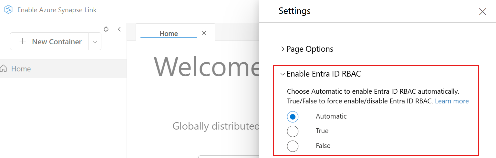
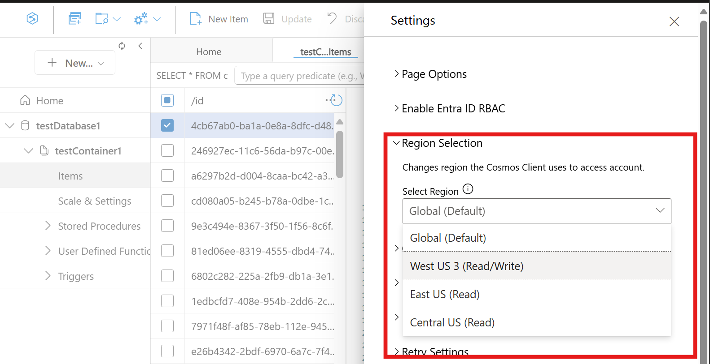

# Use the Azure Cosmos DB Data Explorer to manage your data

Azure Cosmos DB Data Explorer is a web-based interface that allows you to view and manage the data stored in Azure Cosmos DB.

The dedicated Azure Cosmos DB Data Explorer (<https://cosmos.azure.com>) has a few key advantages when compared to the Azure portal's Data Explorer experience, including:

- Full screen real-estate to browse data, run queries, and observe query results
- Ability to provide users without access to the Azure portal or an Azure subscription read or read-write capabilities over data in containers
- Ability to share query results with users who don't have an Azure subscription or Azure portal access

## Prerequisites

- An existing Azure Cosmos DB account.
  - If you don't have an Azure subscription, [Try Azure Cosmos DB free](https://cosmos.azure.com/try/).

## Access the Data Explorer directly using your Azure subscription

You can use access the Data Explorer directly and use your existing credentials to quickly get started with the tool.

1. Navigate to <https://cosmos.azure.com>.

1. Select **Sign In**. Sign in using your existing credentials that have access to the Azure Cosmos DB account.

1. Next, select your Azure subscription and target account from the **Select a Database Account** menu.

    
   
## Access the Data Explorer from the Azure portal using your Azure subscription

If you're already comfortable with the Azure portal, you can navigate directly from the in-portal Data Explorer to the standalone Data Explorer.

1. Sign in to [Azure portal](https://portal.azure.com/).

1. Navigate to your existing Azure Cosmos DB account.

1. In the resource menu, select **Data Explorer**.

1. Next, select the **Open Full Screen** menu option.

    
   
1. In the **Open Full Screen** dialog, select **Open**.

## Customize your data views with the Custom Column Selector

The Custom Column Selector in Azure Cosmos DB Data Explorer allows you to customize your data views by selecting specific columns that are most relevant to your analysis when using the NoSQL API. Previously, in the Data Explorer items view, you could only see the partition key and ID columns. Now, with this new feature, you can select one or many properties from your document and create extra columns to easily view your data. 

1. Sign in to [Azure portal](https://portal.azure.com/).

1. Navigate to your existing Azure Cosmos DB account.

1. In the resource menu, select **Data Explorer**.

1. (Optional) Next, select the **Open Full Screen** menu option.

    
   
1. In the **Open Full Screen** dialog, select **Open**.

1. Once in Data Explorer, open the collection you want to query, select Items.

1. Select on the ellipsis menu on the top right of any Column, select Edit Column

1. Select the columns you want to display and save your settings.

1. Your data view now reflects only the selected columns, making it easier to focus on relevant data.

### Remove a Custom Column

1. Once in Data Explorer, open the collection you want to query, select Items.

1. Select on the ellipsis menu on the top right of any Column, select Remove Column.

1. **Sort your Column View ascending or descending**
 
1. Once in Data Explorer, open the collection you want to query, select Items.

1. Select on the ellipsis menu on the top right of any Column, select Remove Column.

### Reset your Column View

1. Once in Data Explorer, open the collection you want to query, select Items.

1. Select on the ellipsis menu on the top right of any Column, select Edit Column.

1. Select Reset to return to the default view. Or you can Clear your Filter History, Columns, and Viewport settings by selecting the gear icon in the top right Data Explorer Global menu and select Clear History.

## Using Filter History

Filter History enables you to quickly revisit and apply previous filters. This feature saves you from the repetitive task of manually reconstructing filters for recurring queries. With Filter History, you can access a log of your past filters and reapply them with a simple select. This feature is beneficial for users who perform regular analyses on similar datasets.

### Apply a Saved Filter

1. Once in Data Explorer, open the collection you want to query, select Items.

1. Select Edit Filter.

1. Apply a filter to your data as you normally would.

1. Your filter will be automatically saved and added to the Default filter list in the filter dialog after applying the filter.

1. To reapply a previous filter, select on the Edit Filter button.

1. Clear any Filter from the filter window. This step is required to be able to view your saved Filters.

1. Select the Drop Down in the filter window, and select the desired filter from the list.

1. Select Apply Filter

### Clear your Filter History

1. In Data Explorer, select the gear icon in the top right corner of Data Explorer to access settings

1. Select the Clear History button

1. Confirm you want to clear your history. This included filter column splitter positions, custom columns, and your tab layout.

## Change your Query Window view

A new feature in the query view lets you switch between horizontal and vertical views for the query and results panel. You can toggle between these views by selecting the "Views" option in the command bar menu.

1. **Save your Query Window view preferences**

1. In Data Explorer, select the gear icon in the top right corner of Data Explorer to access settings.

1. Select "Default Query Results View" from the dropdown menu.

1. Select either horizontal or vertical as your default view.

1. Select Save to apply your settings.

## Configure request unit threshold

In the Data Explorer, you can configure a limit to the request units per second (RU/s) that queries use. Use this functionality to control the cost and performance in request units (RU) of your queries. This functionality can also cancel high-cost queries automatically.

1. Start in the explorer for the target Azure Cosmos DB account.

1. Select the **Settings** menu option.

    
   
1. In the **Settings** dialog, configure whether you want to **Enable RU threshold** and the actual **RU threshold** value.

    
   
    > [!TIP]
    > The request unit (RU) threshold is enabled automatically with a default value of **5,000** request units.

## Use with Microsoft Entra authentication

You can use Microsoft Entra-based authentication within the explorer by enabling it via configuration. For more information about role-based access control, see the [security guide](security.md).

1. Start in the explorer for the target Azure Cosmos DB account.

1. Select the **Settings** menu option.

1. In the **Settings** dialog, configure whether you want to **`Enable Entra ID (RBAC)`** using one of three possible values:

 | | Description |
 | --- | --- |
 | **Automatic (default)** | Role-based access control is automatically used if key-based authentication is disabled for your account. Otherwise, Data Explorer uses key-based authentication for data requests. |
 | **True** | Role-based access control is always used for data requests. If role-based access control isn't configured correctly for the account or identity, then the requests fail. |
 | **False** | Key-based authentication is always used for data requests. If key-based authentication is disabled, then the requests fail. |

   > [!NOTE]
   > Changing this setting to an option that uses key-based authentication could trigger a request to retrieve the primary key on behalf of the identity that is signed in.

4. Data Explorer signs in automatically using your account. This step might open a brief popup window without asking you for a credential entry. If automatic sign in fails or if popups are blocked in your browser, you must use the **Login for Entra ID RBAC** button (located on the Data Explorer command bar) and allow popups for Data Explorer before making any data requests.

    > [!TIP]
    > The Azure Cosmos DB Data Explorer also supports the option to manually set the value of the **`Enable Entra ID (RBAC)`** to `True` using the <https://cosmos.azure.com?feature.enableAadDataPlane=true> URL.

## Select Data Explorer client region

When you access a NoSQL account with Microsoft Entra Authentication (control plane role-based access control), you see the Region Selection option in settings. Selecting a region forces Data Explorer to send all requests to that specific region. 

To select a region:

1. Sign in to your account with Microsoft Entra Authentication through the portal or directly through your Azure subscription.

1. Open the **Settings** menu.

1. Use the **Select Region** drop-down to choose **Global** or the required region.

If you select a **read-only** region, Data Explorer disables write, update, and delete operations.

If you select **Global**, the client uses the account's global endpoint and enables endpoint discovery to route requests to the optimal region. If you select any **specific region**, the client disables endpoint discovery and sends all requests only to the selected region. 

## Known issues

Here are a few currently known issues:

- Browsing items that contain a UUID isn't supported in Data Explorer. This limitation doesn't affect loading containers, only viewing individual items or queries that include these items. To view and manage these items, users should continue to use the same tooling/SDKs that was originally used to create these items.

- HTTP 401 errors could occur due to insufficient role-based access control permissions for your Microsoft Entra ID account. This condition can be true particularly if the account has a custom role. Any custom roles must have the `Microsoft.DocumentDB/databaseAccounts/listKeys/*` action included to use the Data Explorer.

## Next step

> [!div class="nextstepaction"]
> [Getting started with queries](/cosmos-db/query/overview)
