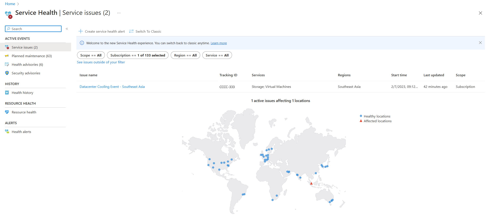

# Disaster recovery guidance for Azure Cosmos DB
[!INCLUDE[NoSQL, MongoDB, Cassandra, Gremlin, Table](includes/appliesto-nosql-mongodb-cassandra-gremlin-table.md)]

Azure Cosmos DB provides industry-leading high availability with a comprehensive suite of built-in business continuity and disaster recovery (BCDR) capabilities. The service offers multiple availability guarantees depending on configuration, with SLAs up to 99.999% for multi-write region accounts or using Per Partition Automatic Failover (PPAF) capability. Azure Cosmos DB also provides turnkey disaster recovery capabilities that enable quick recovery in the event of a regional outage.

Though Azure Cosmos DB continuously strives to provide high availability, the service might occasionally experience outages that cause an account to become unavailable and impact an application. When service monitoring detects widespread connectivity errors, failures, or performance issues, the service automatically declares an outage to keep you informed.

This article provides guidance on preparing for potential service outages and the actions to take during an outage to ensure business continuity.

## Service outage

In the event of an Azure Cosmos DB service outage, you can find details related to the outage in the following places:

### Azure portal banner

If a subscription is identified as impacted, there's an outage alert of a Service Issue in the Azure portal Notifications.

### Help + support or Support + troubleshooting

When you create a support ticket from **Help + support** or **Support + troubleshooting**, there's information about any issues impacting your resources. Select **View outage details** for more information and a summary of impact. There's also an alert in the **New support request** page.

### Service Health

The **Service Health** page in the Azure portal contains information about Azure data center status globally. Search for `service health` in the search bar in the Azure portal, then view **Service issues** in the **Active events** category. You can also view the health of individual resources in the **Resource health** page of any resource under the **Help** menu.

### Email notification

If alerts are configured, an email notification is sent from `azure-noreply@microsoft.com` when a service outage impacts a subscription and resource. For more information on service health alerts, see [Receive activity log alerts on Azure service notifications using Azure portal](/azure/service-health/alerts-activity-log-service-notifications-portal).

### Service metrics

You can [monitor and configure alerts for Azure Cosmos DB availability metrics](monitor.md) in the Azure portal. Azure Cosmos DB provides comprehensive metrics for monitoring availability, request rates, request units consumption, and storage.

## When to initiate disaster recovery during an outage

In the event of a service outage impacting application resources, consider the following courses of action:

- Azure teams work diligently to restore service availability as quickly as possible, but depending on the root cause, recovery can sometimes take longer. If an application can tolerate downtime, wait for the recovery to complete. In this case, no action is required. View the health of individual resources on the **Resource health** page under the **Help** menu. Refer to the Resource health page for updates and the latest information about an outage. After the region recovers, application availability is restored.

- If the outage duration approaches the RTO, decide whether to wait for service recovery or initiate disaster recovery. Depending on the application's tolerance for downtime and potential business liability, make an informed decision about how to respond to prolonged unavailability.

## Outage recovery guidance

The recovery approach for an Azure Cosmos DB account depends on the account configuration. This section provides detailed guidance based on different account types and outage scenarios.

## Recovery options by account configuration

The following table summarizes the recovery options available based on the Azure Cosmos DB account configuration and the type of outage:

| Account configuration | Outage scenario | Recovery approach | Section reference |
|---|---|---|---|
| Single-region account | Region outage | Wait for service restoration or request account restore from backup to another region. | [Single-region accounts](#single-region-accounts) |
| Single-write region, multiple-region account | Read region outage | SDK reroutes to available regions based on configuration; consider taking the region offline for strong consistency in two-region accounts. | [Read region outage](#read-region-outage) |
| Single-write region, multiple-region account | Write region outage (with PPAF enabled) | Automatic partition-level failover. | [Accounts enabled with per-partition automatic failover](#accounts-enabled-with-per-partition-automatic-failover-ppaf-preview) |
| Single-write region, multiple-region account | Write region outage (without PPAF) | Perform offline region operation. | [Region offline operation](#region-offline-operation)|
| Multiple-write region account | Any region outage | Automatic routing to healthy regions via SDK configurations; no manual intervention required. | [Multiple-write region accounts](#multiple-write-region-accounts) |
| Any account configuration | Data corruption or accidental deletion | Point-in-time restore (continuous backup) or restore from periodic backup. | [Continuous backup and point-in-time restore](#continuous-backup-and-point-in-time-restore), [Periodic backup and restore](#periodic-backup-and-restore) |

---
### Single-region accounts

A single-region account with **Availability Zones** can maintain read-write availability when an outage affects only one availability zone. However, if multiple availability zones or the entire region is impacted, single-region accounts lose read and write access until service is restored.

**Recommended actions during a single-region outage:**

1. **Wait for service restoration** - Monitor the Service Health page and the account's Resource Health for updates. Azure teams work to restore service as quickly as possible.

1. **Consider account restoration** - If the outage duration exceeds the RTO, request a restore to a different region through Azure Support. See [Periodic backup and restore](#periodic-backup-and-restore) for details.

1. **Plan for multi-region deployment** - To prevent future single-region outages, consider deploying to multiple regions.  

### Single-write region, multiple-region accounts

For accounts configured with a single write region and one or more read regions, the impact and recovery approach depends on which region is affected.

#### Read region outage

If the account is configured as zone-redundant in the affected read region, it can sustain an availability zone outage without impacting read availability. For regional outages affecting a read region, consider these actions:

**SDK configuration for read resilience:**

- **Configure preferred regions list** - Ensure that a preferred regions list is used in the Azure Cosmos DB SDK configuration. The SDK automatically retries operations in another region if a preferred region becomes unavailable. During a read region outage, the SDK detects the region outage through backend response codes, marks it as unavailable, and routes future operations to the next available region in the preference list. Ensure that the preferred regions list is set correctly and aligns with business and latency requirements. For detailed guidance, see [Troubleshoot Azure Cosmos DB SDK availability](troubleshoot-sdk-availability.md).

**Consistency level considerations:**

Reads should typically remain unaffected during a regional outage if the preferred regions list is configured correctly, as the Azure Cosmos DB SDK automatically reroutes requests to the next available region. However, specific consistency levels or configurations can lead to disruptions:

- **Strong Consistency** - For accounts with only two regions, a read region outage impacts write availability because strong consistency requires [dynamic quorum](consistency-levels.md#dynamic-quorum) to maintain strict consistency guarantees. With only one operational region, quorum can't be achieved, leading to disruptions in both read and write operations.
  - **Mitigation**: Perform a [region offline operation](how-to-manage-database-account.yml) for the affected read region to restore availability. If service-managed failover is enabled, Azure Cosmos DB eventually performs the region offline operation automatically, but this could take time based on how the outage is progressing. For faster recovery, perform a region offline operation or customer-managed failover.

- **Bounded Staleness Consistency** - When the read region has an outage and the staleness window is exceeded, write operations for the partitions in the affected region are also impacted. This occurs because Bounded Staleness consistency relies on maintaining a specific staleness threshold between regions. When this threshold is breached, the system can no longer guarantee consistency for writes.
  - **Mitigation**: Perform a [region offline operation](how-to-manage-database-account.yml#perform-forced-failover-for-your-azure-cosmos-db-account) for the affected read region to restore availability. 

To minimize these risks, consider deploying additional regions and reviewing consistency level settings to ensure alignment with the application's high availability and performance requirements.

#### Write region outage

If the account is configured as zone-redundant in the write region, it can sustain an availability zone outage without impacting write availability. When a regional outage affects the write region, you have several options:

##### Accounts enabled with per-partition automatic failover (PPAF) (Preview)

If an account is enabled with [per-partition automatic failover (PPAF)](how-to-configure-per-partition-automatic-failover.md), the service automatically manages failovers for partitions in an error state, ensuring service continuity during partial or complete regional outages.

  
##### Region offline operation

If an account isn't enabled with PPAF, perform a region offline operation to restore availability.

The region offline operation removes the affected region from the account configuration, allowing the service to restore availability to the remaining regions. To initiate this operation, [take the region offline](how-to-manage-database-account.yml#perform-forced-failover-for-your-azure-cosmos-db-account) for the affected write region. 

> [!NOTE]
> If using private endpoints with an Azure Cosmos DB account, ensure that the private DNS is routing correctly after the offline region operation. For detailed guidance, see [Failover considerations for private endpoints](failover-considerations-for-private-endpoints.md).

**Region restoration:**

- The Azure Cosmos DB team completes the online region operation, which might take three or more business days, depending on the account size.
- Once the region is brought online, it's added as a read region. If this was the write region before the outage, manually change the write region to restore it as the write region when appropriate. This might require coordinating other changes made to the application or service during the outage.

##### Service-managed failover

Service-managed failover allows Azure Cosmos DB to fail over the write region of a multiple-region account to preserve business continuity.

**Configuration:**

- **Azure portal**: Navigate to the Azure Cosmos DB account, select **Replicate data globally**, and enable **Service Managed Failover**.
- **Azure PowerShell**: Follow the instructions to enable [service managed failover](manage-with-powershell.md#enable-automatic-failover).
- **Azure CLI**: Follow the instructions to enable [service managed failover](manage-with-cli.md#enable-service-managed-failover)

> [!IMPORTANT]
> Even with service-managed failover enabled, the timing of automatic failover depends on the nature and progression of the outage. In these scenarios, failover might take up to one hour or more. To quickly restore write availability during outages, perform the [region offline operation](#region-offline-operation) instead of waiting for service-managed failover.

**Region restoration:**

- The Azure Cosmos DB team completes the online region operation, which might take three or more business days, depending on the outage extent and resolution. You can request a [support ticket](/azure/azure-portal/supportability/how-to-create-azure-support-request) to request online if the region is taking longer than expected to come back online.
- Once the region is brought online, it's added as a read region. If this was the write region before the outage, manually switch the write region when appropriate.

##### Operations to avoid during region outages

> [!WARNING]
> Don't perform the following control plane operations during outage scenarios, as they result in account inconsistency and delay recovery:
> - Change write region (manual failover) or modify failover priority
> - Update the account to multi-write configuration

### Multiple-write region accounts

If an Azure Cosmos DB account is configured with multiple write regions, the service automatically handles regional failures without requiring manual intervention. Applications can continue reading and writing data in available regions with minimal disruption.

**Best practices for multi-write accounts:**

- **Configure SDK** - Ensure that clients are configured to use multiple-write regions with `ApplicationRegion` or `PreferredRegions`. For more information, see [Configure multi-region writes in your application](how-to-multi-master.md).

- **Route traffic away from affected regions** - Use regional application health probes with Azure Traffic Manager or Azure Front Door to automatically route traffic away from the affected region.

**Key characteristics:**
- No manual failover required during regional outages.
- Applications automatically connect to healthy regions based on SDK configuration.
- Write availability is maintained as long as at least one region is available.

For more information, see [Distribute data globally](distribute-data-globally.md) and [Multi-region writes](multi-region-writes.md).

### Continuous backup and point-in-time restore

If data recovery is needed due to accidental deletion or modification (data corruption), use Azure Cosmos DB's continuous backup mode with point-in-time restore (PITR). This feature allows restoring an account to any point in time within the retention period.

For detailed steps on performing a point-in-time restore, see [Continuous backup with point-in-time restore](continuous-backup-restore-introduction.md).

### Periodic backup and restore

If an account uses periodic backup mode, request a restore from Azure Support. Periodic backups are taken automatically at regular intervals (every four hours by default), and the two most recent backups are retained.

To request a restore from periodic backups:

1. Create a support request in the Azure portal.

1. Select **Backup and Restore** as the problem type.

1. Provide the specific time for the restore.

For more information, see [Configure Azure Cosmos DB account with periodic backup](periodic-backup-restore-introduction.md).

## Related content

To learn more about disaster recovery and business continuity, review:

- [Distribute data globally with Azure Cosmos DB](distribute-data-globally.md)
- [Continuous backup with point-in-time restore in Azure Cosmos DB](continuous-backup-restore-introduction.md)
- [Multi-region writes in Azure Cosmos DB](multi-region-writes.md)
- [Manage an Azure Cosmos DB account](how-to-manage-database-account.yml)
- [Failover considerations for private endpoints](failover-considerations-for-private-endpoints.md)