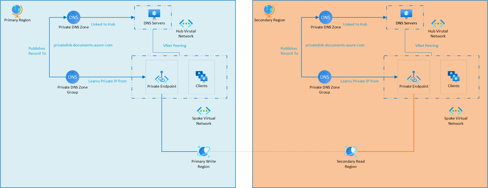
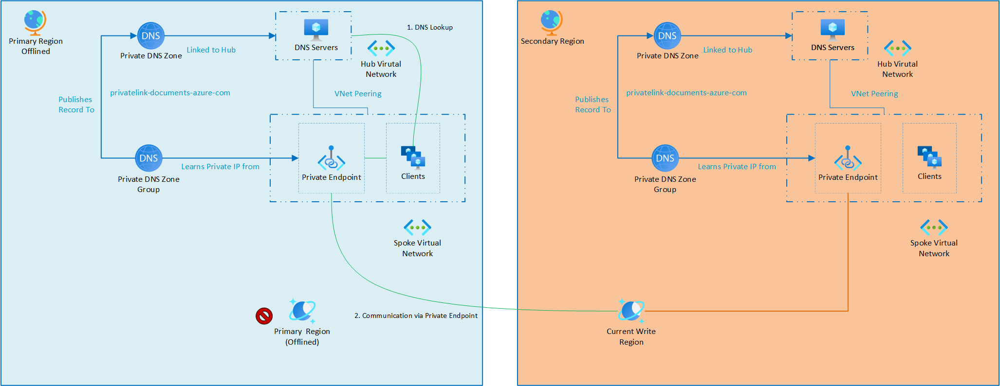
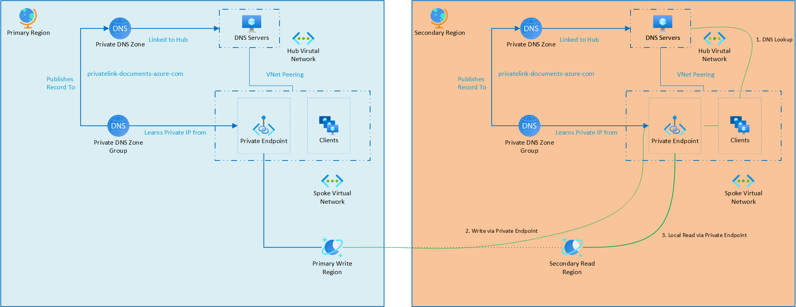
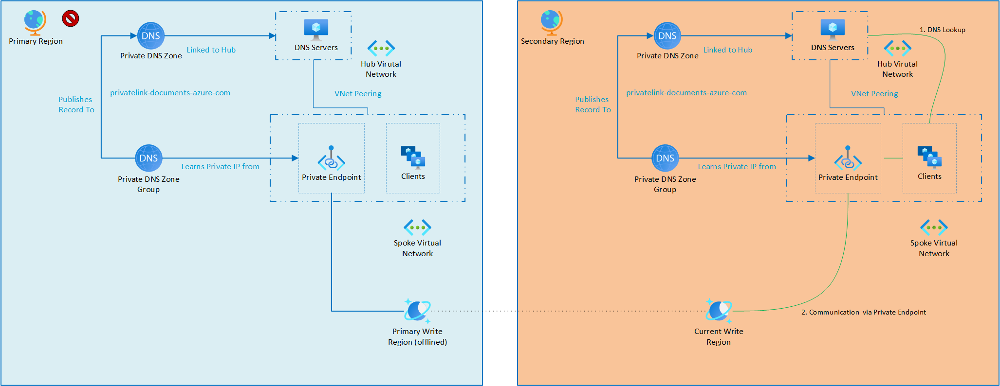
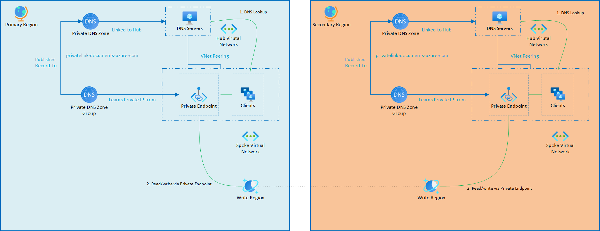

# Failover considerations for Azure Cosmos DB accounts with private endpoints
[!INCLUDE[NoSQL, MongoDB, Cassandra, Gremlin, Table](includes/appliesto-nosql-mongodb-cassandra-gremlin-table.md)]

Azure Cosmos DB operates differently from many other Azure services when it comes to high availability configurations. Instead of relying on a secondary instance deployed by the customer for resiliency, Azure Cosmos DB accounts are configured with a multi-region setup that actively replicate data across selected regions. During a regional outage, failover (offline region) can be initiated to another region to maintain availability.

When an Azure Cosmos DB account fails over, the service name remains unchanged. If the public endpoint is used for connectivity, systems can still access the service through the same DNS resolution, regardless of its failover state. DNS resolution functions seamlessly even when only one region or a subset of services is affected by an outage. This built-in resilience reduces the number of business continuity and disaster recovery (BCDR) tasks required for Azure Cosmos DB.

For customers using private endpoints, additional configuration is required to ensure failover support. This document provides an example architecture of a multi-region Azure Cosmos DB account using private endpoints for secure networking and details the necessary steps for different BCDR scenarios.

## Example architecture

This architecture utilizes primary and secondary regions to support both active/active and active/passive for failover scenarios. Each region includes a network where the Azure Cosmos DB account and other workload solutions are deployed. The multi-region Azure Cosmos DB account has private endpoints in both regions to ensure seamless connectivity. This setup allows applications to connect to the nearest private endpoint, optimizing performance while maintaining resiliency during a failover event.

The two private endpoints cannot use the same Private DNS Zone for the same endpoint. As a result, each region has its own Private DNS Zone. Each regional zone is attached to the hub network for that specific region. This design leverages the [DNS forwarder scenario](/azure/private-link/private-endpoint-dns-integration#virtual-network-and-on-premises-workloads-using-a-dns-forwarder) to provide resolution. As a result, regardless of the region of the virtual machine (VM) accessing the private endpoint, there is a local endpoint available to connect to Azure Cosmos DB. For connections originating from a data center, a VPN connection would be established to the hub network in the respective region. 

For DNS resolution, each data center would configure conditional forwarding to one of the two DNS resolver server sets, ensuring that it resolves to the nearest network location for optimal connectivity.

## Architecture concepts
Azure Cosmos DB supports **multiple private endpoints per account**, enabling you to create regionally distributed endpoints across different virtual networks. For instance, you could have an Azure Cosmos DB private endpoint in both each region, each independently serving traffic from its respective virtual network.

In traditional hub-and-spoke topologies, this setup is less common due to Private DNS Zone limitations—each zone can only contain one record per DNS name. Once you link a private endpoint to a Private DNS Zone, any additional endpoints in other regions must use **separate Private DNS Zones** to avoid DNS conflicts.

Additionally, Azure Cosmos DB private endpoints are not region-bound. You can deploy a private endpoint in one region to access an Azure Cosmos DB account hosted in a different region, enabling flexible networking configurations.

To ensure proper resolution, each region should have its own region-specific Private DNS Zone mapped to the local endpoint. This setup allows resources in each region to route traffic correctly. While deploying private endpoints in the same region as your Azure Cosmos DB account is often preferred for cost and latency optimization, supporting multi-region private endpoints can be critical for high availability and regional failover scenarios, ensuring continued private access even if one region becomes unavailable.

## Failover scenarios

This topology supports the following scenarios, each with its own DNS failover considerations.

| Scenario | Description | DNS Considerations |
|---|---|---|
| [Scenario 1 – Azure Cosmos DB Failover](#scenario-1-azure-cosmos-db-failover) | A service interruption in the primary region requires Azure Cosmos DB to fail over to a secondary region.| No changes required |
| [Scenario 2 - Other Services Failover](#scenario-2-other-services-failover) | A service interruption affects other services in the primary region, but Azure Cosmos DB does not need to be failed over. | If the outage impacts the DNS servers hosted in the primary region, then the conditional forwarders from on-premises need to be updated to the secondary region. |
| [Scenario 3 - Whole Region Outage](#scenario-3-whole-region-outage) | A major service outage affects multiple services, requiring both Azure Cosmos DB and other services to fail over. | Conditional forwarders from on-premises DNS need to be updated to the secondary region. |
| [Scenario 4 – Multi-write configuration](#scenario-4-multi-write-configuration) | Azure Cosmos DB and other services operate in an active/active configuration across multiple regions.| No changes required |

### Scenario 1: Azure Cosmos DB failover

In this scenario, an issue with the Azure Cosmos DB account requires it to fail over to a secondary region. Since Azure Cosmos DB is designed for high availability, regional outages are uncommon, but they should still be planned for.

When Azure Cosmos DB [forced failover(offline region)](how-to-manage-database-account.yml) is triggered, it fails over to the secondary region, the network routing remains unchanged. No modifications to DNS are necessary, each region continues to use its local private endpoint to communicate with Azure Cosmos DB.
After failover (offline region) – the service will operate as illustrated:
 

Once the primary region becomes healthy again, the Azure Cosmos DB account is failed back, restoring the original write region without requiring any changes to the network configuration.

### Scenario 2: Other services failover

In this scenario, the issue lies not with the Azure Cosmos DB account, but with the services that connect to it, such as application services, virtual machines, or containers. These services need to be failed over to a secondary region following their respective disaster recovery plans.

For example, virtual machines might use Azure Site Recovery to replicate workloads in advance, while application services could be redeployed to the secondary region using CI/CD pipelines or platform-native scaling features.

Once the services are active in the secondary region, they can immediately begin connecting to Azure Cosmos DB via the local regional private endpoint. Azure Cosmos DB requires no changes to support this—the endpoints are already provisioned to allow seamless access from multiple regions.

If there's an on-premises network connected through VPN, connectivity will continue as long as DNS resolution via the hub remains operational. However, if the hub's DNS infrastructure is impacted (e.g., due to a VM or DNS service outage), the on-premises DNS forwarders may need to be reconfigured to point to the secondary region’s DNS resolvers until the primary region is restored.

After the failover, services in the secondary region will function as shown:

Once the primary region is restored, services can be failed back, and any temporary DNS changes for on-premises systems can be reverted.

### Scenario 3: Whole region outage

In this scenario, there is a regional outage severe enough that both the Azure Cosmos DB account and the dependent application services must be failed over to a secondary region.

This failover follows a combined model similar to the previous two scenarios: the Azure Cosmos DB account fails over to its secondary write region, and Azure services (such as web apps, VMs, or containers) are redeployed or activated in the secondary region. The primary region is effectively non-functional, but the architecture ensures that services continue to run from the secondary region with minimal disruption.

As with earlier cases, if the primary hub network is unable to handle DNS resolution, for example due to a DNS infrastructure outage, then on-premises conditional DNS forwarders should be temporarily updated to use resolvers in the secondary region to maintain private endpoint connectivity.

After failover, the architecture functions as shown:

Once the primary region is restored, workloads can be failed back, and on-premises DNS settings can be reverted to their original configuration.

### Scenario 4: Multi-write configuration
In this scenario, Azure Cosmos DB is configured for multi-region writes, allowing it to accept writes in multiple regions simultaneously. An outage occurs in one region, impacting local application services, but Azure Cosmos DB remains available globally due to its distributed nature.

Since multi-write accounts have their own regional read/write endpoints, no Azure Cosmos DB failover is needed. The application simply fails over to another active region where services are still running and can continue to read and write to Azure Cosmos DB using the regional private endpoint.
Key behaviors in this scenario:
 - **No Azure Cosmos DB failover** is required — the other regions continue to handle writes seamlessly.
 - **Application services** (e.g., App Services, AKS, or VMs) are rehydrated or scaled up in an alternate region.
 - **Regional private endpoints** are already provisioned, enabling immediate connectivity without DNS changes.
 - **On-premises clients** continue to operate as long as their DNS forwarders can resolve to a valid private endpoint. If DNS services in the failed region are impacted, they should temporarily point to the DNS resolvers in the active region.

When the primary region is restored, application services can fail back if desired. No changes to Azure Cosmos DB are required. The platform continues replicating data across all write regions as configured.

## Related content
- [Azure Cosmos DB private endpoints overview](how-to-configure-private-endpoints.md)
- [How to manage Azure Cosmos DB account failover](how-to-manage-database-account.yml)
- [Azure Cosmos DB private endpoint DNS integration](/azure/private-link/private-endpoint-dns-integration)