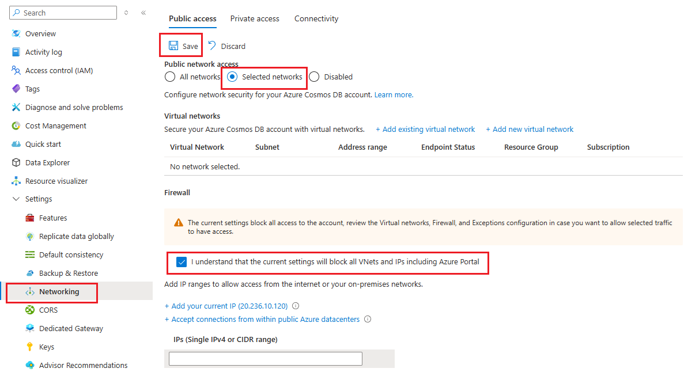
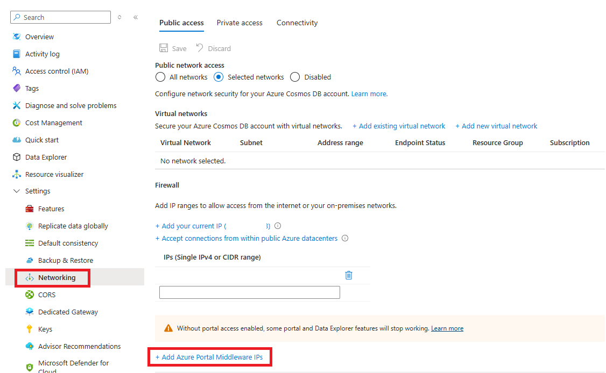
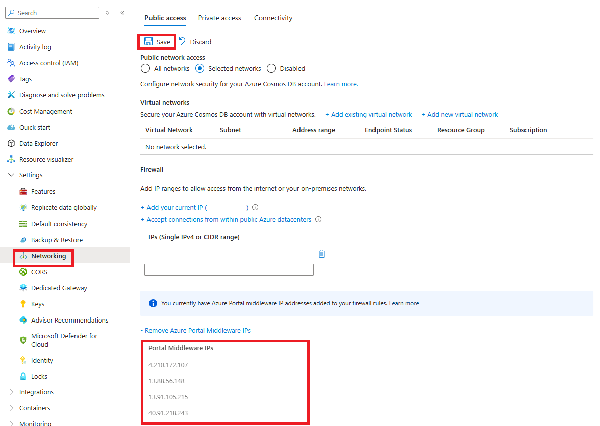
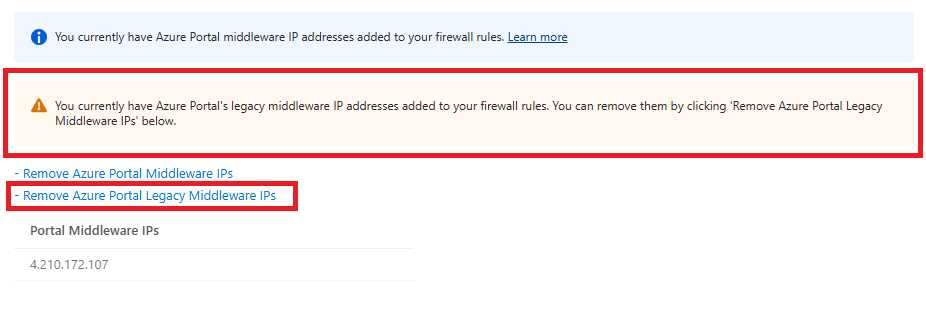
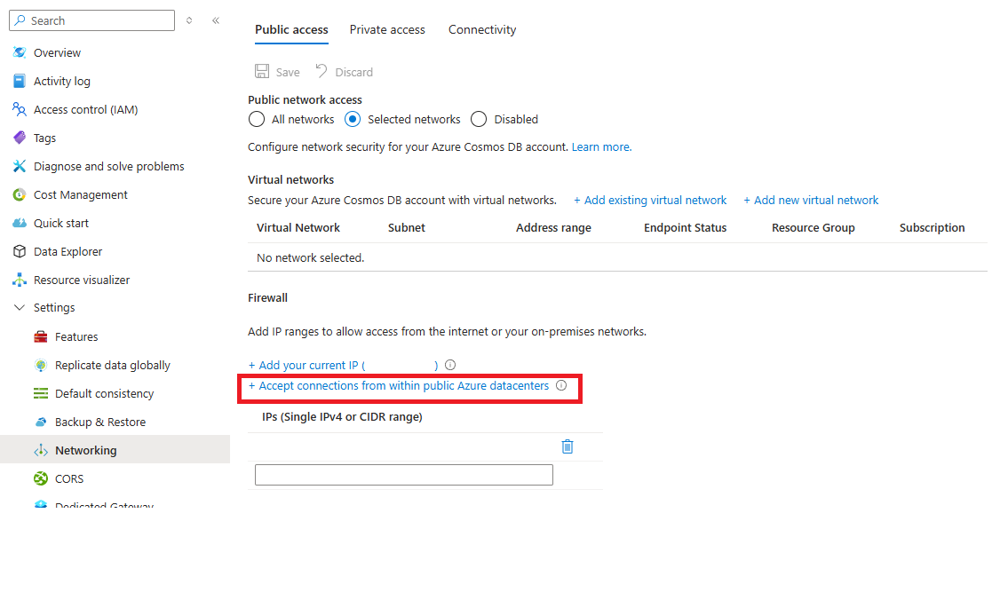
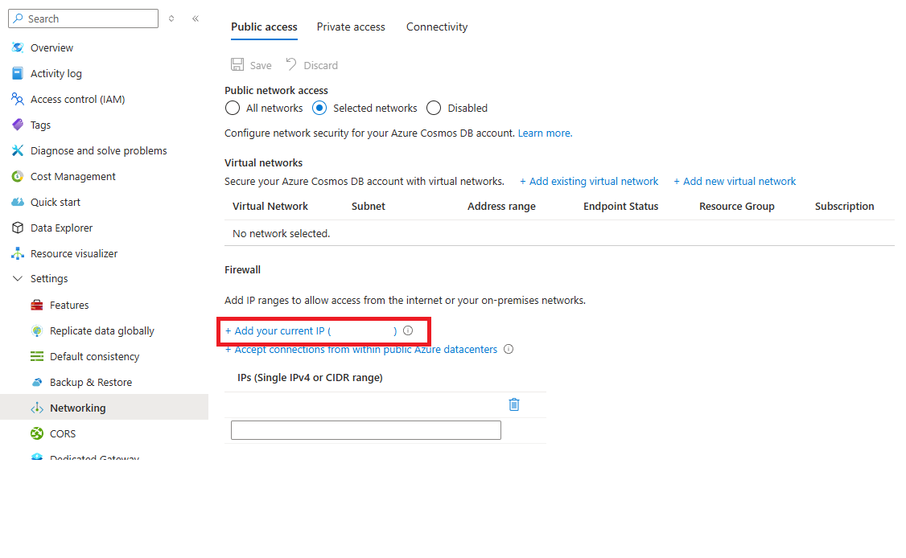

# Configure IP firewall for Azure Cosmos DB

To secure the data stored in your account, Azure Cosmos DB uses a secret-based authorization model with a strong hash-based message authentication code (HMAC). Additionally, Azure Cosmos DB uses IP-based access controls for inbound firewall security. This model is similar to the firewall rules of a traditional database system and adds another layer of security to your account. With firewalls, configure your Azure Cosmos DB account to allow access only from an approved set of machines or cloud services. Access to data stored in your Azure Cosmos DB database from these approved machines and services still requires the caller to present a valid authorization token.

## IP access control

By default, your Azure Cosmos DB account is accessible from the internet if the request includes a valid authorization token. To configure IP policy-based access control, the user must provide the set of IP addresses or IP address ranges in CIDR (Classless Inter-Domain Routing) form to be included as the allowed list of client IPs to access a given Azure Cosmos DB account. After you apply this configuration, any requests from machines outside this allowed list receive a 403 (Forbidden) response. When you use an IP firewall, some scenarios might require you to enable access from the Azure portal. For more information, see [allow requests from the Azure portal](#allow-requests-from-the-azure-portal). When using data explorer for an API for NoSQL, Gremlin or Table account, you also need to update your firewall settings to add your current IP address to the firewall rules. Firewall changes might take up to 15 minutes to propagate, and the firewall might behave inconsistently during this period.

Combine IP-based firewalls with subnet and virtual network access control. By combining them, you can limit access to any source that has a public IP and/or from a specific subnet within virtual network. To learn more about using subnet and virtual network-based access control see [Access Azure Cosmos DB resources from virtual networks](./how-to-configure-vnet-service-endpoint.md).

To summarize, an authorization token is always required to access an Azure Cosmos DB account. If IP firewall and virtual network Access Control List (ACLs) aren't set up, the Azure Cosmos DB account can be accessed with the authorization token. After you set up IP firewall rules or virtual network access lists for your Azure Cosmos DB account, only requests from the allowed sources will work. These requests must also include a valid authorization token to get a response.

You can secure the data stored in your Azure Cosmos DB account by using IP firewalls. Azure Cosmos DB supports IP-based access controls for inbound firewall support. Set an IP firewall on the Azure Cosmos DB account using one of the following methods:

- From the Azure portal
- Declaratively by using an Azure Resource Manager template
- Programmatically through the Azure CLI or Azure PowerShell by updating the **ipRangeFilter** property

## Configure an IP firewall by using the Azure portal

To set the IP access control policy in the Azure portal, go to the Azure Cosmos DB account page and select **Networking** on the navigation menu. Set the **Allow access from** value to **Selected networks**, and then select **Save**. If you aren't adding any IP addresses yet, you also need to **check the box to acknowledge that all VNets and IPs are blocked**. If you change the public network access setting, such as turning it off or letting all networks connect, any firewall IP addresses you set before are removed.



When IP access control is on, the Azure portal lets you specify IP addresses, IP address ranges, and switches. Switches enable access to other Azure services and the Azure portal. The following sections give details about these switches.

> [!NOTE]
> When you turn on IP access control for your Azure Cosmos DB account, only requests from allowed IP addresses can reach your account. If an IP address isn't on the allowed list, its requests are blocked. You also can't browse your Cosmos DB resources in the Azure portal unless you allow portal access.

### Allow requests from the Azure portal

When you enable an IP access control policy programmatically, you might need to add the IP addresses for the Azure portal services to the **ipRangeFilter** property to keep using some portal functionality. 

Portal scenarios that require enabling this option include:

- Specifically for the API for the MongoDB or API for Apache Cassandra, accessing accounts with Data Explorer or <https://cosmos.azure.com>
- For all APIs, using the following Azure Cosmos DB sections within the Azure portal:
  - Browse Collections
  - Power BI
  - Azure Synapse

You can enable requests to access the Azure portal by selecting the **Add Azure Portal Middleware IPs** option, as shown in the following screenshot:



The Azure portal Middleware IP addresses are added to a separate list, as shown in the following screenshot. Select **Save** to add these addresses to your database account. More details on the Middleware IP addresses can be found further in this article.



The Azure portal Middleware IP addresses can be removed by selecting the **Remove Azure Portal Middleware IPs** option and then selecting **Save**.

#### Azure portal Middleware IP Addresses

The Azure portal Middleware IP addresses are listed here. Some IP addresses are only required for specific Database Account APIs. When you add the Middleware IP Addresses in the portal, as described previously, only the IP addresses required for your account are added.  
  
For example:

- For an API for NoSQL account, the IP addresses from the **All** category are added. 
- For an API for MongoDB account, the IP addresses from the **All** and **MongoDB only** categories are added.

##### Azure Public

| Database Account API | IP addresses |
| --- | --- |
| All | `13.91.105.215`, `4.210.172.107`, `13.88.56.148`, `40.91.218.243` |
| MongoDB only | `20.245.81.54`, `40.118.23.126`, `40.80.152.199`, `13.95.130.121` |
| Apache Cassandra only | `40.113.96.14`, `104.42.11.145`, `137.117.230.240`, `168.61.72.237` |

##### Azure operated by 21Vianet

| Database Account API | IP addresses |
| --- | --- |
| All | `163.228.137.6`, `143.64.170.142` |
| MongoDB only | `52.131.240.99`, `143.64.61.130` |
| Apache Cassandra only | `40.73.99.146`, `143.64.62.47` |

##### Azure US Government

| Database Account API | IP addresses |
| --- | --- |
| All | `52.247.163.6`, `52.244.134.181` |
| MongoDB only | `52.244.176.112`, `52.247.148.42` |
| Apache Cassandra only | `52.244.50.101`, `52.227.165.24` |

#### Legacy Middleware IP Addresses

The Cosmos DB portal services recently transitioned to new infrastructure that required new Middleware IP addresses. With the completion of that transition, the legacy IP addresses used by the old infrastructure can now be safely removed. If your account has legacy Middleware IP addresses present in the firewall rules, the **Remove Azure Portal Legacy Middleware IPs** option is displayed. Select that option and then Save to remove the legacy IP addresses.



The legacy IP addresses are dependent on cloud environment:

| Azure Environment |  IP Addresses |
| --- | --- |
| Azure Public | `104.42.195.92`, `40.76.54.131`, `52.176.6.30`, `52.169.50.45`, `52.187.184.26` |
| Azure operated by 21Vianet | `139.217.8.252`, `52.176.6.30`, `52.169.50.45`, `52.187.184.26` |
| Azure US Government | `52.244.48.71`, `52.176.6.30`, `52.169.50.45`, `52.187.184.26` |

> [!NOTE]
> If you're experiencing challenges connecting to your Azure Cosmos DB account from the Data Explorer, review the [Data Explorer troubleshooting guide](/troubleshoot/azure/cosmos-db/data-explorer).

### Allow requests from global Azure datacenters or other sources within Azure

Some Azure services, like Azure Stream Analytics and Azure Functions, don't use a fixed IP address. You can still use the IP firewall to control access for these services. To allow access from other Azure resources, choose the **Accept connections from within Azure datacenters** option. This option lets services running in Azure connect to your Cosmos DB account.



When you enable this option, the IP address `0.0.0.0` is added to the list of allowed IP addresses. The `0.0.0.0` IP address restricts requests to your Azure Cosmos DB account from Azure datacenter IP range. This setting doesn't allow access for any other IP ranges to your Azure Cosmos DB account.

> [!NOTE]
> Setting publicNetworkAccess to Disabled takes precedence over the **Accept connection from within Azure datacenters** option. See [blocking-public-network-access-during-account-creation](/azure/cosmos-db/how-to-configure-private-endpoints?tabs=arm-bicep#blocking-public-network-access-during-account-creation)

> [!NOTE]
> This option configures the firewall to allow all requests from Azure, including requests from the subscriptions of other customers deployed in Azure. The list of IPs allowed by this option is wide, so it limits the effectiveness of a firewall policy. Use this option only if your requests don’t originate from static IPs or subnets in virtual networks. Choosing this option automatically allows access from the Azure portal because the Azure portal is deployed in Azure.

### Requests from your current IP

To simplify development, the Azure portal helps identify and add the IP of your client machine to the allowed list. Apps running your machine can then access your Azure Cosmos DB account.

The portal automatically detects the client IP address. It might be the client IP address of your machine, or the IP address of your network gateway. Make sure to remove this IP address before you take your workloads to production.

To add your current IP to the list of IPs, select **Add your current IP**. Then select **Save**.



### Requests from cloud services

In Azure, cloud services are a common way for hosting middle-tier service logic by using Azure Cosmos DB. To let a cloud service connect to your Azure Cosmos DB account, add the public IP address of the cloud service to your allowed IP list. You can perform this operation by updating the IP access control policy in the Azure portal. This step ensures that all role instances of cloud services have access to your Azure Cosmos DB account.

You can retrieve IP addresses for your cloud services in the Azure portal, as shown in the following screenshot:

:::image type="content" source="media/how-to-configure-firewall/public-ip-addresses.png" alt-text="Screenshot showing the public IP address for a cloud service displayed in the Azure portal.":::
When you scale out your cloud service by adding role instances, the new instances automatically have access to the Azure Cosmos DB account because they're part of the same cloud service.

### Requests from virtual machines

You can also use [virtual machines](https://azure.microsoft.com/services/virtual-machines/) or [virtual machine scale sets](/azure/virtual-machine-scale-sets/overview) to host middle-tier services by using Azure Cosmos DB. To let a virtual machine connect to your Azure Cosmos DB account, add its public IP address to the allowed list. You can perform this step by updating the IP access control policy. This configuration also works for virtual machine scale sets. Once you add the public IP address, the virtual machine can access your Cosmos DB account.

You can retrieve IP addresses for virtual machines in the Azure portal, as shown in the following screenshot:

:::image type="content" source="media/how-to-configure-firewall/public-ip-addresses-dns.png" alt-text="Screenshot showing a public IP address for a virtual machine displayed in the Azure portal.":::

When you add virtual machine instances to the group, they automatically receive access to your Azure Cosmos DB account.

### Requests from the internet

To connect to your Azure Cosmos DB account from a computer on the internet, add that computer’s IP address or IP range to the allowed list. Only computers you add to this list can reach your Cosmos DB account.

### Add outbound rules to the firewall

To get a current list of outbound IP ranges to add to your firewall settings, see [Download Azure IP Ranges and Service Tags](https://www.microsoft.com/download/details.aspx?id=56519).

To automate the list, see [Use the Service Tag Discovery API](/azure/virtual-network/service-tags-overview#use-the-service-tag-discovery-api).

## Configure an IP firewall by using a Resource Manager template

To set up access control for your Azure Cosmos DB account, ensure that the Resource Manager template specifies the **ipRules** property with an array of allowed IP ranges. If setting up IP Firewall for an already deployed Azure Cosmos DB account, ensure the `locations` array matches the current deployment. You can't modify the `locations` array and other properties at the same time. For more information and samples of Azure Resource Manager templates for Azure Cosmos DB, see [Azure Resource Manager templates for Azure Cosmos DB](samples-resource-manager-templates.md).

> [!IMPORTANT]
> The **ipRules** property is introduced with API version `2020-04-01`. Earlier versions use an **ipRangeFilter** property instead, which is a list of comma-separated IP addresses.

The example shows how the **ipRules** property is exposed in API version 2020-04-01 or later:

```json
{
  "type": "Microsoft.DocumentDB/databaseAccounts",
  "name": "[variables('accountName')]",
  "apiVersion": "2020-04-01",
  "location": "[parameters('location')]",
  "kind": "GlobalDocumentDB",
  "properties": {
    "consistencyPolicy": "[variables('consistencyPolicy')[parameters('defaultConsistencyLevel')]]",
    "locations": "[variables('locations')]",
    "databaseAccountOfferType": "Standard",
    "enableAutomaticFailover": "[parameters('automaticFailover')]",
    "ipRules": [
      {
        "ipAddressOrRange": "13.91.105.215"
      },
      {
        "ipAddressOrRange": "4.210.172.107"
      },
      {
        "ipAddressOrRange": "13.88.56.148"
      },
      {
        "ipAddressOrRange": "40.91.218.243"
      }
    ]
  }
}
```

Here's the same example for any API version earlier than `2020-04-01`:

```json
{
  "type": "Microsoft.DocumentDB/databaseAccounts",
  "name": "[variables('accountName')]",
  "apiVersion": "2019-08-01",
  "location": "[parameters('location')]",
  "kind": "GlobalDocumentDB",
  "properties": {
    "consistencyPolicy": "[variables('consistencyPolicy')[parameters('defaultConsistencyLevel')]]",
    "locations": "[variables('locations')]",
    "databaseAccountOfferType": "Standard",
    "enableAutomaticFailover": "[parameters('automaticFailover')]",
    "ipRangeFilter":"13.91.105.215,4.210.172.107,13.88.56.148,40.91.218.243"
  }
}
```

## Configure an IP access control policy using the Azure CLI

The following command shows how to create an Azure Cosmos DB account with IP access control:

```azurecli-interactive
# Create an Azure Cosmos DB account with default values and IP firewall enabled
resourceGroupName='MyResourceGroup'
accountName='mycosmosaccount'
ipRangeFilter='192.168.221.17,183.240.196.255,40.76.54.131'

# Ensure there are no spaces in the comma-delimited list of IP addresses or CIDR ranges.
az cosmosdb create \
    -n $accountName \
    -g $resourceGroupName \
    --locations regionName='West US 2' failoverPriority=0 isZoneRedundant=False \
    --locations regionName='East US 2' failoverPriority=1 isZoneRedundant=False \
    --ip-range-filter $ipRangeFilter
```

## Configure an IP access control policy using PowerShell

The following script shows how to create an Azure Cosmos DB account with IP access control:

```azurepowershell-interactive
# Create an Azure Cosmos DB account with default values and IP Firewall enabled
$resourceGroupName = "myResourceGroup"
$accountName = "mycosmosaccount"
$ipRules = @("192.168.221.17","183.240.196.255","40.76.54.131")

$locations = @(
    @{ "locationName"="West US 2"; "failoverPriority"=0; "isZoneRedundant"=False },
    @{ "locationName"="East US 2"; "failoverPriority"=1, "isZoneRedundant"=False }
)

# Make sure there are no spaces in the comma-delimited list of IP addresses or CIDR ranges.
$CosmosDBProperties = @{
    "databaseAccountOfferType"="Standard";
    "locations"=$locations;
    "ipRules"=$ipRules
}

New-AzResource -ResourceType "Microsoft.DocumentDb/databaseAccounts" `
    -ApiVersion "2020-04-01" -ResourceGroupName $resourceGroupName `
    -Name $accountName -PropertyObject $CosmosDBProperties
```

## Troubleshoot issues with IP access control policies

You can troubleshoot issues with an IP access control policy by using the following options:

### Azure portal

Enabling an IP access control policy for your Azure Cosmos DB account blocks all requests from machines outside the allowed list of IP address ranges. To enable portal data-plane operations like browsing containers and querying documents, explicitly allow Azure portal access by using the **Firewall** pane in the portal.

### Software development kits

When you access Azure Cosmos DB resources by using software development kits (SDKs) from machines that aren't in the allowed list, a generic **403 Forbidden** response is returned with no extra details. Check the allowed IP list for your account, and ensure the correct policy configuration is applied to your Azure Cosmos DB account.

### Source IPs in blocked requests

View each request and response by enabling diagnostic logging on your Azure Cosmos DB account. The firewall-related messages are logged with a 403 return code. By filtering these messages, you can see the source IPs for the blocked requests. See [Azure Cosmos DB diagnostic logging](./monitor.md).

### Requests from a subnet with a service endpoint for Azure Cosmos DB enabled

Requests from a subnet in a virtual network with a service endpoint for Azure Cosmos DB enabled send the virtual network and subnet identity to Azure Cosmos DB accounts. These requests don't have the public IP of the source, so IP filters reject them. To allow access from specific subnets in virtual networks, add an access control list as outlined in [How to configure virtual network and subnet-based access for your Azure Cosmos DB account](how-to-configure-vnet-service-endpoint.md). It can take up to 15 minutes for firewall rules to apply and the firewall could exhibit an inconsistent behavior during this period.

### Private IP addresses in list of allowed addresses

Creating or updating an Azure Cosmos DB account with a list of allowed addresses containing private IP addresses fails. Make sure that no private IP address is specified in the list.

## Related content

- [Virtual network and subnet access control for your Azure Cosmos DB account](how-to-configure-vnet-service-endpoint.md)
- [Configure virtual network and subnet based access for your Azure Cosmos DB account](how-to-configure-vnet-service-endpoint.md)
