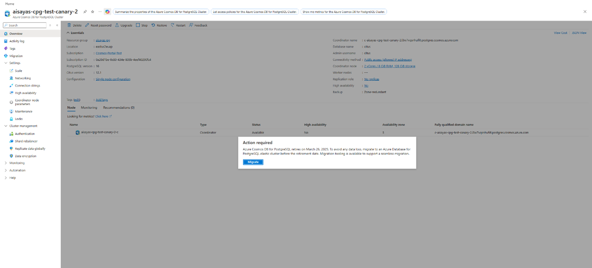
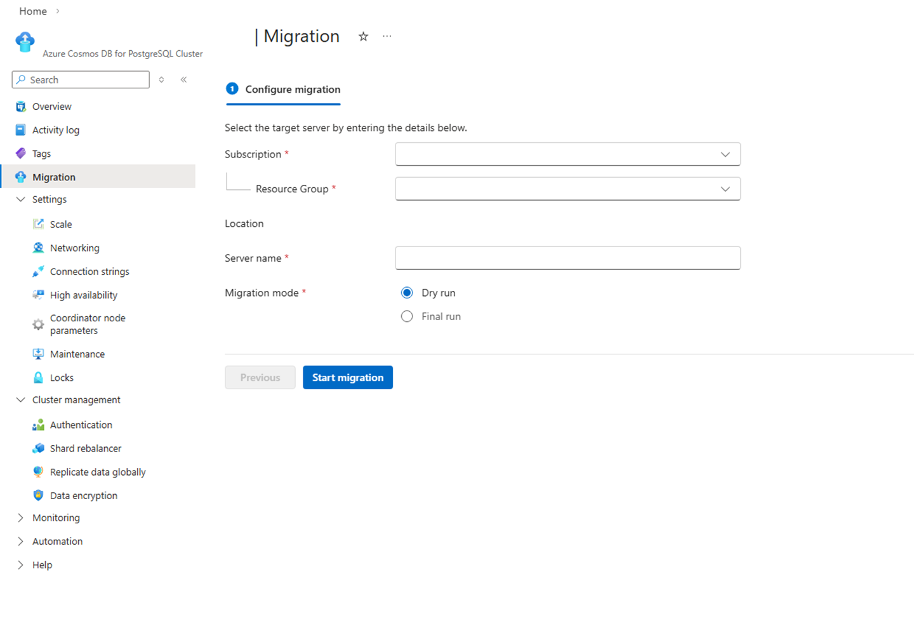
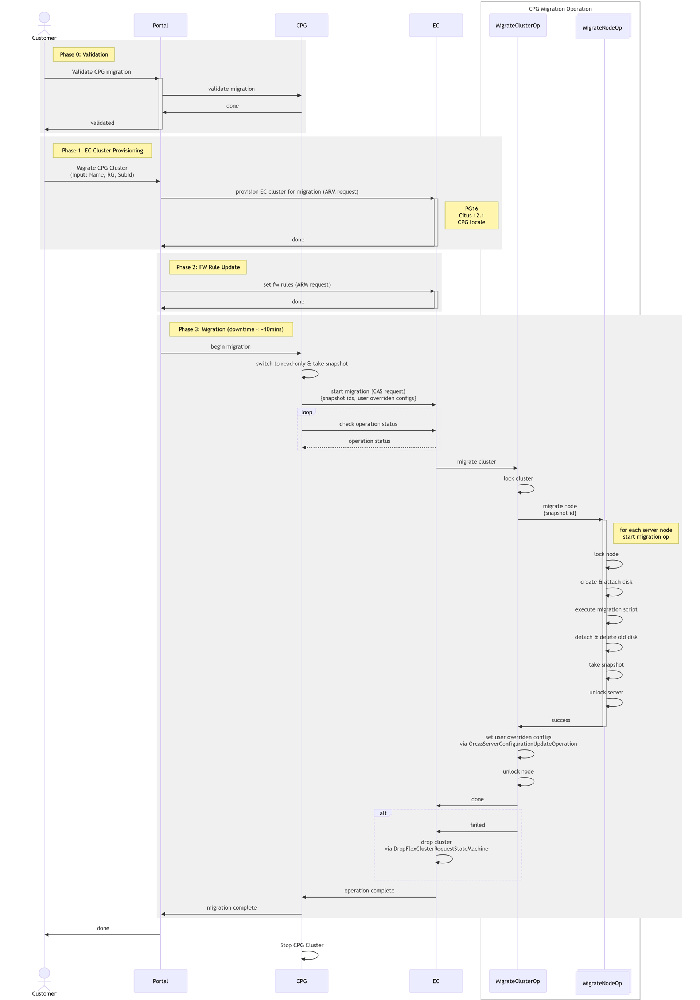

# Benefits of Azure Database for PostgreSQL with Elastic Cluster

Azure Database for PostgreSQL – Elastic Clusters is the next evolution of Azure's distributed PostgreSQL offering, built on Azure Database for PostgreSQL Flexible Server with the Citus extension. For customers running Azure Cosmos DB for PostgreSQL today, Elastic Clusters delivers feature parity for distributed Postgres workloads while providing a more integrated, flexible, and cost-effective path forward.

- **A clear forward-looking roadmap**: Elastic Clusters is the strategic direction for distributed PostgreSQL on Azure, with ongoing investments (for example, planned enhancements such as planned failovers, storage autogrow, and long-term retention). Azure Cosmos DB for PostgreSQL is on retirement path with limited support during this period.

- **Lower and simpler cost model (no dedicated coordinator surcharge)**: Elastic Clusters doesn't require a separately billed coordinator-only node, which can reduce baseline costs and makes pricing easier to predict as you scale out.

- **More flexible performance choices**: Choose between Burstable, General Purpose, and Memory Optimized tiers and newer compute series to right-size cost and performance per node as workloads evolve.

- **Run queries from any node**: Elastic Clusters enables query access through any node, improving operational flexibility for tooling, troubleshooting, and workload patterns that benefit from multiple ingress points.

- **Modern PostgreSQL capabilities sooner**: Faster adoption of newer PostgreSQL versions (including PostgreSQL 17 support) helps customers access security updates, performance improvements, and new language features earlier.

- **Built on Azure Database for PostgreSQL Flexible Server**: Elastic Clusters inherits the operational model customers already use for Flexible Server—backups, monitoring/metrics, maintenance controls, and platform integration—reducing day-2 operations complexity.

- **Stronger identity and security integration**: Support for managed identity and Entra ID authentication helps simplify secret management and align database access with enterprise identity controls.

## Feature comparison

| **Feature/Category** | **Azure Cosmos DB for PostgreSQL** | **Azure Database for PostgreSQL Elastic Clusters** | **Notes/Parity** |
| --- | --- | --- | --- |
| **Base Technology** | PostgreSQL + Citus extension (distributed tables/shards) | PostgreSQL + Citus extension (horizontal sharding) | Parity. |
| **Sharding Models** | Row-based (distributed tables), schema-based (distributed schemas) | Row-based and schema-based sharding | Parity. |
| **Architecture** | Coordinator node + worker nodes (shared-nothing) | Multiple Flexible Server nodes interconnected as a Citus cluster | Similar; Elastic is built on Flexible Server instances. |
| **Horizontal Scaling** | Add worker nodes; rebalance shards | Add worker nodes; rebalance data | Parity. |
| **Vertical Scaling** | Scale compute/storage per node | Scale compute/storage per node | Parity. |
| **High Availability** | Yes (zone-redundant options; automatic failover) | Yes (cluster-aware HA) | Parity. |
| **Read Replicas** | Yes | Yes | Parity. |
| **Dedicated coordinator (extra cost)** | Yes | No | Elastic advantage. |
| **Query from any node** | No | Yes | Elastic advantage. |
| **Compute choices** | Burstable or fixed memory-to-core ratio; no choice of compute generations | Burstable, General Purpose, Memory optimized; choice of compute series | Elastic advantage. |
| **Max compute per node (cores)** | 96 vCores | 96 (soon 192) | Parity. |
| **Pricing (Memory optimized)** | Node: \$0.1425/vCore hour + coordinator (\$0.44/hr) or \$0.11/vCore hour | \$0.125/vCore hour (no dedicated coordinator) | Elastic advantage (simpler cost model). |
| **Compute pricing (General Purpose)** | N/A | \$0.09/vCore hour | Elastic only. |
| **Storage pricing** | \$0.115/GB-month | \$0.115/GB-month | Parity. |
| **Online rebalancing** | Yes | Yes | Parity. |
| **PostgreSQL versions** | Up to recent versions (e.g., 15/16 historically) | Supports latest, including PostgreSQL 17 | Elastic advantage (newer version support). |
| **Postgres 17/18 support** | No | Yes | Elastic advantage (newer version support). |
| **Extensions support** | Subset of key extensions (e.g., PostGIS, JSONB) | Standard Flexible Server extensions; some limitations (e.g., no TimescaleDB in cluster mode) | Parity (minor differences). |
| **Entra ID authentication** | Yes | Yes | Parity. |
| **HA planned failovers** | No | Planned (GA+) | Gap (planned). |
| **Private endpoints** | Yes | Yes | Parity. |
| **Virtual network** | No | No | Parity (not supported). |
| **PgBouncer support** | — | Yes | Elastic advantage (newer version support). |
| **Max connections per node** | 300 (0–3 vCores) pert node; 500 (4–15 vCores) per node; 1000 (16+ vCores) per node. Max 2500 | 3000 per node | Elastic advantage. |
| **Cluster or node-level metrics** | Yes | Yes | Parity. |
| **Multi-tenant monitoring** | Yes | Yes | Parity. |
| **Create NOLOGIN role** | No | Yes | Elastic advantage. |
| **Maintenance windows** | Yes | Yes | Parity. |
| **Geo backup & restore** | Yes | Yes | Parity. |
| **Managed identity** | No | Yes | Elastic advantage. |
| **Customer-managed keys (encryption)** | Yes | Yes | Parity. |
| **Terraform** | Yes | Yes | Parity. |
| **Storage autogrow** | No | Planned (GA+) | Elastic advantage. |
| **Premium SSD v2 (80K IOPS/node)** | No | Planned (GA+) | Elastic advantage. |
| **Remove node** | No\* | No | Parity |
| **Long-term retention** | No | Roadmap (GA+) | Elastic advantage. |
| **Query store** | No | Roadmap (GA+) | Elastic advantage. |
| **Management & integration** | Part of Azure Cosmos DB portal/experience; ties to Cosmos ecosystem | Integrated into Azure Database for PostgreSQL Flexible Server (e.g., backups, metrics, Entra ID) | Different portals; Elastic leverages Flexible Server features. |
| **Pricing model** | vCore-based; separate for coordinator/workers | vCore, storage, IOPS (no extra cost for Citus) | Elastic advantage (simpler model). |
| **Networking** | Public access (firewall rules), private access (Private Link), or both | Public access (allowed IP addresses); private access via Private Link on underlying Flexible Server nodes | Parity (similar options). |

## Migration Tool

A dedicated migration tool is provided to facilitate seamless transition from Azure Cosmos DB for PostgreSQL to Azure Database for PostgreSQL Elastic Cluster. This tool automates schema and data migration, minimizes downtime, and ensures data integrity.

The migration approach centers on creating a new data disk on Flex by taking a snapshot from a CPG cluster and mounting it as the primary data disk of the target Elastic Cluster (EC), drastically reducing migration time and ensuring data fidelity without being affected by network quality. Then we will copy the delta files (extensions, PG & extension configs, certs, archive logs, etc.) from the original Flex /datadrive into the new disk.

The tool along with the popup reminder will be available through the Migration tab in Azure Cosmos DB for PostgreSQL starting April 13th.

From there, the migration can be initiated by providing simple details for the target server

### SKU Mapping

The Azure Cosmos DB for PostgreSQL will be matched to the target Azure Database for PostgreSQL (Elastic Cluster) as per the below mapping table. After migration, customers can scale up or down with almost 0 downtime.

| **Source ServerEdition** | **Source vCores** | **Target Name** | **Target Tier** |
| --- | --- | --- | --- |
| BurstableMemoryOptimized | 1 | Standard_B2s | Burstable |
| BurstableGeneralPurpose | 2 | Standard_B2s | Burstable |
| GeneralPurpose | 2 | Standard_D2ds_v5 | GeneralPurpose |
| GeneralPurpose | 4 | Standard_D4ds_v5 | GeneralPurpose |
| GeneralPurpose | 8 | Standard_D8ds_v5 | GeneralPurpose |
| GeneralPurpose | 16 | Standard_D16ds_v5 | GeneralPurpose |
| GeneralPurpose | 32 | Standard_D32ds_v5 | GeneralPurpose |
| GeneralPurpose | 64 | Standard_D64ds_v5 | GeneralPurpose |
| GeneralPurpose | 96 | Standard_D96ds_v5 | GeneralPurpose |
| MemoryOptimized | 2 | Standard_E2ds_v5 | MemoryOptimized |
| MemoryOptimized | 4 | Standard_E4ds_v5 | MemoryOptimized |
| MemoryOptimized | 8 | Standard_E8ds_v5 | MemoryOptimized |
| MemoryOptimized | 16 | Standard_E16ds_v5 | MemoryOptimized |
| MemoryOptimized | 32 | Standard_E32ds_v5 | MemoryOptimized |
| MemoryOptimized | 64 | Standard_E64ds_v5 | MemoryOptimized |
| MemoryOptimized | 96 | Standard_E96ds_v5 | MemoryOptimized |

### Migration flow

1. User starts migration from the CPG cluster page in Azure Portal.

1. Portal runs pre-validation checks. 

1. If checks pass, Portal provisions the target Elastic Cluster (EC) with CPG-migration settings (e.g., collation/PG+Citus version setup). 

1. Portal will start migration on the provisioned EC. 

1. Migration tool switches the CPG cluster to read-only and triggers snapshot creation (one per node for multi-node). 

1. It calls Elastic Cluster with snapshot resource IDs to begin the disk-based migration. 

1. It creates new data disk(s) from the snapshot(s), locks the EC, stops containers, and swaps the new disk in as the primary */datadrive*. 

1. It copies "delta" platform files onto the new disk (extensions, PG/extension configs, certs, archive/WAL, etc.), then restores ownership/permissions and performs required metadata fixes (e.g., node mappings, roles, extensions). 

1. It starts containers and completes the migration operation;

1. After success, tool applies post-migration settings to EC (user-overridden configs, HA settings). 

1. Migration completes: Portal updates the success/failure when complete.CPG Cluster will be stopped and Elastic Cluster becomes the new writable target where the customer switches over (new connection string, recreate PEC if needed). 

### Average migration timing

In most cases, the end-to-end migration completes in **under 10 minutes**. The **write-lock (read-only) window**—from the point the source cluster is switched to read-only until the target Elastic Cluster is writable—typically averages **~5–8 minutes**, making it suitable to run within a standard scheduled maintenance window.

**Key factors that can affect timing**: database size and number of nodes (more snapshots/disks), extension footprint.

## Related content

- [Azure Database for PostgreSQL](/azure/postgresql)
