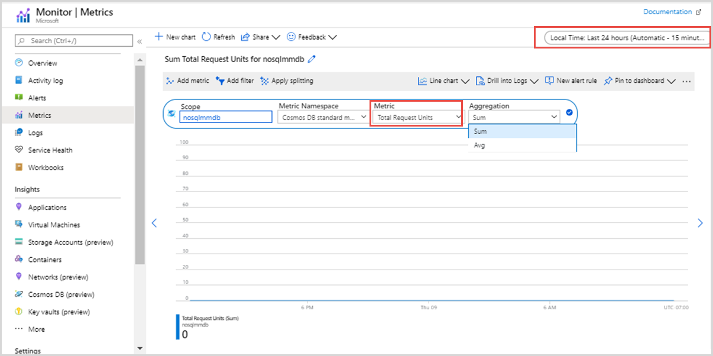

# Understand Request Units Consumption in Azure Cosmos DB

Azure Cosmos DB uses Request Units (RUs) as a normalized measure of the resources required to execute database operations. Instead of managing provisioning of resources such as CPU, memory, and I/O independently, RUs provide a simple and consistent way to understand how different operations consume resources. Each operation consumes Request Units reflecting the work performed by the service to execute the request with a focus on trying to ensure predictability.
This article explains what influences RU consumption, how common operations consume RUs, and practical ways to design efficient workloads.

## What influences RU consumption

### Document size
Request Units consumption for an operation scales with document size due to the increased CPU and I/O needed to process larger documents.

|**Document Size** |**Read Operation*** |**Write Operation**
|---------|---------|---------|
|1 KB |1.00 | 4.95  |
|2 KB |1.04 | 6.29  |
|4 KB |1.14 | 6.67  |
|8 KB |1.33 | 7.04  |
|16 KB |1.67 | 9.52  |
|32 KB |2.19 | 11.23  |
|64 KB |4.76 | 22.67 |
|128 KB |9.95 | 48.19  |
|256 KB |20.28 | 98.29  |
|512 KB |40.95 | 184.57 |
|1,024 KB |145.90 | 625.00  |
|2,048 KB |291.80 | 1250.00 |

*Read RUs mentioned are applicable to session and eventual consistency. 

### Indexing
Indexes improve query performance but increase the RUs consumed by write operations. Indexing only required properties reduces RU consumption for writes and updates while balancing query performance. For more information on how to index only required properties, see [indexing policy](index-policy.md).

### Configuration choices
Some features require more processing that influences RU consumption, such as:

* Consistency level of read requests
* Computed properties
* Customer managed keys
* Dynamic data masking

### Additional factors

#### RU consumption in multi-region accounts
When an account has multiple regions, Azure Cosmos DB provisions throughput independently in each region, enabling low latency access and high availability.

* **Write** operations consume RUs for writing data in the primary region and for replicating the data to additional regions. As a result, write RU consumption increases with the number of regions configured.
* **Read** operations consume RUs in the region they're served from.

This model ensures predictable performance and durability while making global distribution transparent.

#### RU consumption in multi-region write accounts 

Multi-region write accounts allow write operations across all account regions. RU consumption for document operations follows the same general principles as multi-region accounts, with more processing to coordinate conflicting writes across regions.
Because of this added coordination, the unit price of RUs in this configuration differs from single-region write setups. For current pricing details, see [Azure Cosmos DB pricing](https://azure.microsoft.com/pricing/details/cosmos-db/).

## How Request Units consumption evolves

Request Units consumption in Azure Cosmos DB evolves over time as platform efficiency improves through hardware upgrades and service optimizations. These improvements are typically passed on to customers automatically, often resulting in more efficient RU consumption without any application changes. For example, binary encoding of stored data reduced the persisted size of documents, which lowered RU consumption for read operations without requiring any application changes.

Although specific RU values can change over time, the principles remain consistent and predictable. Customers can achieve better cost efficiency by focusing on the factors that influence RU consumption, including document size, indexing decisions, configuration choices, and access patterns.

## Document operations and Request Units

Request Units are consumed based on the work required to perform an operation. This section explains how RUs are consumed across common document operations, using illustrative examples to highlight the underlying principles.

[!Important]
The RU values described in this document are illustrative and reflect how Azure Cosmos DB processes operations at a given point in time.

### Write Operations
Different types of write operations follow similar principles. RU consumption primarily depends on **document size** and **indexed properties**.

#### Create
A create operation includes:
* Inserting the document
* Adding indexed terms defined by the indexing policy

**Example:** 
RUs consumed for a 1-KB document with 10 indexed terms in one region:
5.0 (document size based) + 0.2 × 10 (indexing) = 7 RUs

#### Updates (replace)
Update operations involve:
* Deleting the existing document
* Inserting the new document
* Deleting any modified indexed terms
* Inserting any modified indexed terms

**Example:**
Updating a 1-KB document with two modified indexed terms:
5.0 (deletion) + 5.0 (insertion) + 0.2 × 2 (index deletion) + 0.2 × 2 (index insertion) = 10.8 RUs

[!Tip]
Updates approximately consume twice as many RUs as creates when only a small number of index terms change.

#### Patch

Patch operations update specific properties within a document. The RUs consumed is similar to a replace operation and scales with the number of modified properties.

**Example:**
Updating a 1-KB document with two modified indexed terms:
5.0 (deletion) + 5.0 (insertion) + 0.2 × 2 (index removal) + 0.2 × 2 (index insertion) + 0.4 * 2 (base charge for patch) = 11.6 RUs

#### Delete

Delete operations includes:
* Deleting the document
* Deleting indexed terms

**Example:**
Deleting a 1-KB document with 10 indexed terms:
5.0 (document size) + 0.2 × 10 (index removal) = 7.0 RUs

#### Stored procedures
Stored procedures execute server-side logic and can perform multiple operations within a single request. Their RU consumption depends on the complexity and scope of the logic executed.
To reduce the variability in RUs consumed due to the nature of stored procedures, alternatives such as transactional batch operations or bulk APIs are recommended where feasible.

### Read Operations

#### Point Reads
Point reads (using document ID and partition key) are read operations that are most efficient in resource consumption. RU consumption is based on the persisted document size.

|**Document Size** |**RUs for point read** |
|---------|---------|
|1 KB |1.00 RU |
|100 KB |~10.00 RUs |

#### Feed operations
Feed operations include Change Feed and Read Feed. These operations return a stream or batch of documents rather than a single document.
Feed operations consume RUs based on:
* The number of documents processed
* The size of those documents

**Example:**
Processing five 1-KB documents through a feed consumes approximately the same RUs as reading those five documents individually.

This design provides predictable, linear scaling: as the volume of data processed increases, RU consumption increases proportionally. RU usage depends on data changes and volume, not on how quickly a client consumes the feed.

### Query Operations
Query operations vary the most in RU consumption because they depend on the query shape and how effectively indexes are used. Azure Cosmos DB tries to ensure that the same query, when executed on the same data, consumes the same number of RUs across repeated executions.

Factors affecting Query RUs are:
* Size of the source data 
* Size of the result set 
* Page size and page count 
* Document loading 
* Document parsing 
* Index lookup 
* Scan 
* Number and nature of predicates 
* Use of user-defined functions  
* Projections

### Background operations
Azure Cosmos DB performs certain background operations on behalf of users. These tasks run opportunistically when throughput is available and can consume a proportion of the provisioned throughput.

Examples include: 
* Delete by partition key
* Time-to-live (TTL) deletion
* Unique key reindexing
* Materialized view (GSI) maintenance

## Measuring and monitoring RU consumption

Each request to Azure Cosmos DB returns the number of Request Units (RUs) consumed as part of the response. This value is exposed through the RequestCharge property and represents the RUs consumed by that specific operation.

For query workloads, RU consumption and performance depend on the query shape and index utilization. Enabling [query metrics](optimize-cost-reads-writes.md#metrics-for-troubleshooting-queries) allows you to see how RU consumption is distributed across query execution phases, helping identify opportunities to optimize query performance and reduce RU consumption.

To understand RU consumption at a broader level, you can monitor Total Request Units metrics in the Azure portal. This metric shows RU consumption at the container or database level and supports filters like database name, container name, operation type, region, and response status.

## Key takeaways and best practices

### Keep document size efficient
* RU consumption increases with document size. Smaller documents generally require fewer resources to read, write, and index.
* For large entities, consider modeling data across multiple documents instead of storing everything in a single document.
* Avoid storing large binary payloads in documents. A common best practice is to store this data in Azure Blob Storage and keep only a reference in Azure Cosmos DB.
### Index intentionally
* Indexing speeds up queries but raises RU consumption for writes and updates. Tailor your indexing policy to target only the properties needed for filtering or sorting.
* Design queries to use relevant indexes such as range, composite, or filtered to minimize unnecessary scans.
### Choose efficient access patterns
* Point reads (using document ID and partition key) are the most efficient way to read data.
* Queries scale predictably with the amount of data processed, so shaping queries to return only the required data can significantly reduce RU usage.
### Design for partitioning and locality
* Choose a partition key that evenly distributes data and aligns with common access patterns.
* Where appropriate, colocate related entity types within the same container to reduce cross-container operations and network overhead.
### Monitor RU usage and iterate
* Use request-level diagnostics and Azure Monitor metrics to understand where RUs are being consumed.
* Focus first on identifying operations consuming high RUs, then refine data modeling, indexing, or queries as needed.
