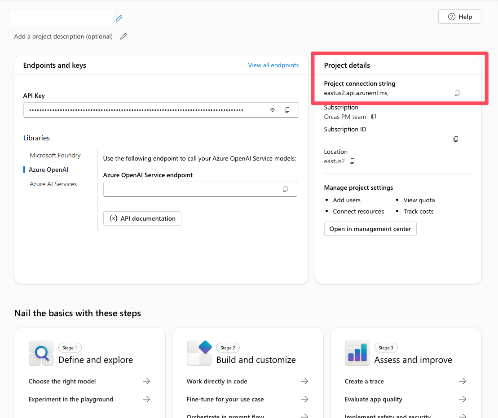
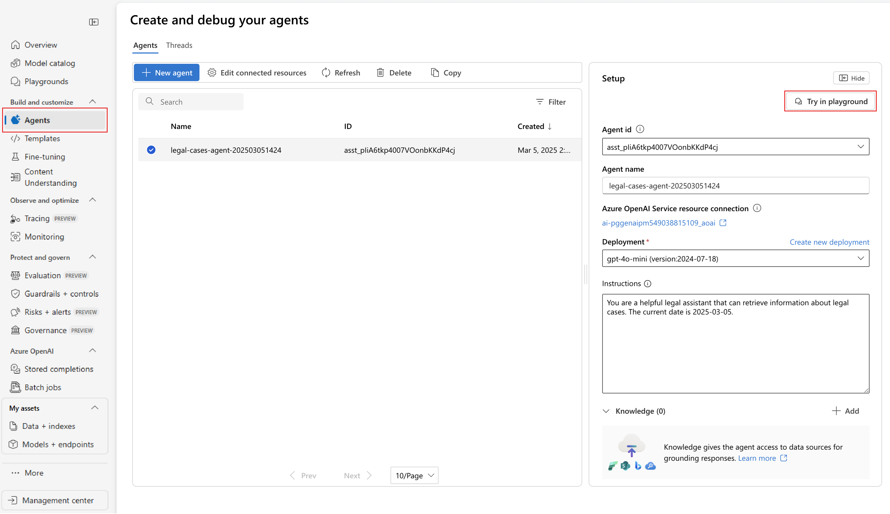
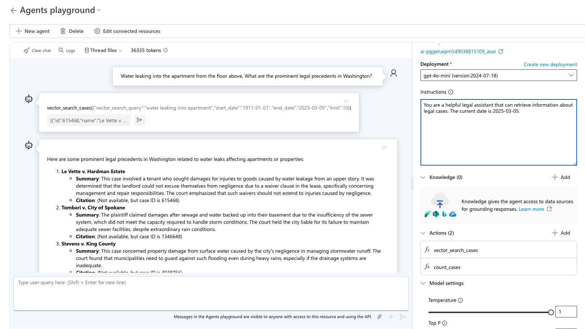
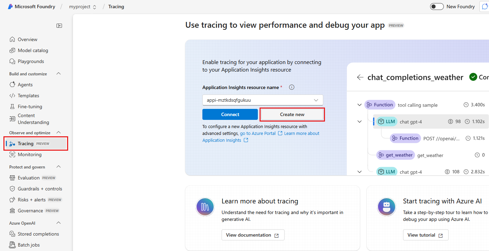

# AI agents in Azure Database for PostgreSQL

AI agents are transforming how applications interact with data by combining large language models (LLMs) with external tools and databases. Agents enable the automation of complex workflows, enhance the accuracy of information retrieval, and facilitate natural language interfaces to databases.

This article explores how to create intelligent AI agents that can search and analyze your data in Azure Database for PostgreSQL. It walks through setup, implementation, and testing by using a legal research assistant as an example.

## What are AI agents?

AI agents go beyond simple chatbots by combining LLMs with external tools and databases. Unlike standalone LLMs or standard retrieval-augmented generation (RAG) systems, AI agents can:

- **Plan**: Break down complex tasks into smaller, sequential steps.
- **Use tools**: Use APIs, code execution, and search systems to gather information or perform actions.
- **Perceive**: Understand and process inputs from various data sources.
- **Remember**: Store and recall previous interactions for better decision-making.

By connecting AI agents to databases like Azure Database for PostgreSQL, agents can deliver more accurate, context-aware responses based on your data. AI agents extend beyond basic human conversation to perform tasks based on natural language. These tasks traditionally required coded logic. However, agents can plan the tasks needed to execute based on user-provided context.

## Implementation of AI agents

Implementing AI agents with Azure Database for PostgreSQL involves integrating advanced AI capabilities with robust database functionalities to create intelligent, context-aware systems. By using tools like vector search, embeddings, and Azure AI Foundry Agent Service, developers can build agents that understand natural language queries, retrieve relevant data, and provide actionable insights.

The following sections outline the step-by-step process to set up, configure, and deploy AI agents. This process enables seamless interaction between AI models and your PostgreSQL database.

### Frameworks

Various frameworks and tools can facilitate the development and deployment of AI agents. All these frameworks support using Azure Database for PostgreSQL as a tool:

- [Azure AI Foundry Agent Service](/azure/ai-services/agents/overview)
- [LangChain/LangGraph](https://python.langchain.com/v0.1/docs/modules/agents/)
- [LlamaIndex](https://docs.llamaindex.ai/en/stable/use_cases/agents/)
- [Semantic Kernel](/semantic-kernel/overview/)
- [AutoGen](https://microsoft.github.io/autogen/)
- [OpenAI Assistants API](https://platform.openai.com/docs/assistants/overview)

## Implementation example

This article's example uses [Azure AI Foundry Agent Service](/azure/ai-services/agents/overview) for agent planning, tool usage, and perception. It uses Azure Database for PostgreSQL as a tool for vector database and semantic search capabilities.

The following sections walk you through building an AI agent that helps legal teams research relevant cases to support their clients in Washington State. The agent:

1. Accepts natural language queries about legal situations.
1. Uses vector search in Azure Database for PostgreSQL to find relevant case precedents.
1. Analyzes and summarizes the findings in a helpful format for legal professionals.

### Prerequisites

1. [Enable and configure](generative-ai-azure-overview.md#enable-the-azure_ai-extension) the `azure_ai` and `pg_vector` extensions.
1. [Create an Azure AI Foundry project](/azure/ai-services/agents/quickstart?pivots=ai-foundry-portal).
1. [Deploy models](/azure/ai-services/agents/quickstart?pivots=ai-foundry-portal#deploy-a-model) `gpt-4o-mini` and `text-embedding-small`.
1. Install [Visual Studio Code](https://code.visualstudio.com/download).
1. Install the [Python](https://marketplace.visualstudio.com/items?itemName=ms-python.python) extension.
1. Install [Python 3.11.x](https://www.python.org/downloads/).
1. Install the [Azure CLI](/cli/azure/install-azure-cli-windows?tabs=powershell) (latest version).

   > [!NOTE]  
   > You need the key and endpoint from the deployed models that you created for the agent.

### Getting started

All the code and sample datasets are available in [this GitHub repository](https://github.com/Azure-Samples/postgres-agents).

### Step 1: Set up vector search in Azure Database for PostgreSQL

First, prepare your database to store and search legal case data by using vector embeddings.

#### Set up the environment

If you're using macOS and Bash, run these commands:

```bash
python -m venv .pg-azure-ai
source .pg-azure-ai/bin/activate
pip install -r requirements.txt
```

If you're using Windows and PowerShell, run these commands:

```bash
python -m venv .pg-azure-ai
.pg-azure-ai \Scripts\Activate.ps1
pip install -r requirements.txt
```

If you're using Windows and `cmd.exe`, run these commands:

```bash
python -m venv .pg-azure-ai
.pg-azure-ai \Scripts\activate.bat
pip install -r requirements.txt
```

#### Configure environment variables

Create an `.env` file with your credentials:

```bash
AZURE_OPENAI_API_KEY=""
AZURE_OPENAI_ENDPOINT=""
EMBEDDING_MODEL_NAME=""
AZURE_PG_CONNECTION=""
```

#### Load documents and vectors

The Python file [load_data/main.py](https://github.com/Azure-Samples/postgres-agents/blob/main/azure-ai-agent-service/load_data/main.py) serves as the central entry point for loading data into Azure Database for PostgreSQL. The code processes the [data for sample cases](https://github.com/Azure-Samples/postgres-agents/blob/main/azure-ai-agent-service/load_data/cases.csv), including information about cases in Washington.

The `main.py` file:

1. Creates necessary extensions, sets up OpenAI API settings, and manages database tables by dropping existing ones and creating new ones for storing case data.
1. Reads data from a CSV file and inserts it into a temporary table, and then processes and transfers it into the main case table.
1. Adds a new column for embeddings in the case table and generates embeddings for case opinions by using OpenAI's API. It stores the embeddings in the new column. The embedding process takes about 3 to 5 minutes.

To start the data loading process, run the following command from the `load_data` directory:

```bash
python main.py
```

Here's the output of `main.py`:

```output
Extensions created successfully
OpenAI connection established successfully
The case table was created successfully
Temp cases table created successfully
Data loaded into temp_cases_data table successfully
Data loaded into cases table successfully.
Adding Embeddings will take a while, around 3-5 mins.
Embeddings added successfully All Data loaded successfully!
```

### Step 2: Create a Postgres tool for the agent

Next, configure AI agent tools to retrieve data from Postgres. Then use the Azure AI Foundry Agent Service SDK to connect your AI agent to the Postgres database.

#### Define a function for your agent to call

Start with defining a function for your agent to call by describing its structure and any required parameters in a docstring. Include all your function definitions in a single file, [legal_agent_tools.py](https://github.com/Azure-Samples/postgres-agents/blob/main/azure-ai-agent-service/src/legal_agent_tools.py). You can then import the file into your main script.

```python
def vector_search_cases(vector_search_query: str, start_date: datetime ="1911-01-01", end_date: datetime ="2025-12-31", limit: int = 10) -> str:
    """
 Fetches the case information in Washington State for the specified query.

 :param query(str): The query to fetch cases specifically in Washington.
 :type query: str
 :param start_date: The start date for the search defaults to "1911-01-01"
 :type start_date: datetime, optional
 :param end_date: The end date for the search, defaults to "2025-12-31"
 :type end_date: datetime, optional
 :param limit: The maximum number of cases to fetch, defaults to 10
 :type limit: int, optional

 :return: Cases information as a JSON string.
 :rtype: str
 """

 db = create_engine(CONN_STR)

 query = """
 SELECT id, name, opinion,
 opinions_vector <=> azure_openai.create_embeddings(
 'text-embedding-3-small', %s)::vector as similarity
 FROM cases
 WHERE decision_date BETWEEN %s AND %s
 ORDER BY similarity
 LIMIT %s;
 """

    # Fetch case information from the database
 df = pd.read_sql(query, db, params=(vector_search_query,datetime.strptime(start_date, "%Y-%m-%d"), datetime.strptime(end_date, "%Y-%m-%d"),limit))

 cases_json = json.dumps(df.to_json(orient="records"))
    return cases_json
 ```

### Step 3: Create and configure the AI agent with Postgres

Now, set up the AI agent and integrate it with the Postgres tool. The Python file [src/simple_postgres_and_ai_agent.py](https://github.com/Azure-Samples/postgres-agents/blob/main/azure-ai-agent-service/src/simple_postgres_and_ai_agent.py) serves as the central entry point for creating and using your agent.

The `simple_postgres_and_ai_agent.py` file:

1. Initializes the agent in your Azure AI Foundry project with a specific model.
1. Adds the Postgres tool for vector search on your database, during the agent initialization.
1. Sets up a communication thread. This thread is used to send messages to the agent for processing.
1. Processes the user's query by using the agent and tools. The agent can plan with tools to get the correct answer. In this use case, the agent calls the Postgres tool based on the function signature and docstring to do a vector search and retrieve the relevant data to answer the question.
1. Displays the agent's response to the user's query.

#### Find the project connection string in Azure AI Foundry

In your Azure AI Foundry project, you find your project connection string from the project's overview page. You use this string to connect the project to the Azure AI Foundry Agent Service SDK. Add this string to the `.env` file.



#### Set up the connection

Add these variables to your `.env` file in the root directory:

```shell
PROJECT_CONNECTION_STRING=" "
MODEL_DEPLOYMENT_NAME="gpt-4o-mini"
AZURE_TRACING_GEN_AI_CONTENT_RECORDING_ENABLED="true"
```

```python
### Create the agent with tool access
We created the agent in the Azure AI Foundry project and added the Postgres tools needed to query the database. The code snippet below is an excerpt from the file [simple_postgres_and_ai_agent.py](https://github.com/Azure-Samples/postgres-agents/blob/main/azure-ai-agent-service/src/simple_postgres_and_ai_agent.py).

# Create an Azure AI Foundry client
project_client = AIProjectClient.from_connection_string(
    credential=DefaultAzureCredential(),
    conn_str=os.environ["PROJECT_CONNECTION_STRING"],
)

# Initialize the agent toolset with user functions
functions = FunctionTool(user_functions)
toolset = ToolSet()
toolset.add(functions)

agent = project_client.agents.create_agent(
    model= os.environ["MODEL_DEPLOYMENT_NAME"],
    name="legal-cases-agent",
    instructions= "You are a helpful legal assistant who can retrieve information about legal cases.",
    toolset=toolset
)
```

#### Create a communication thread

This code snippet shows how to create an agent thread and message, which the agent processes in a run:

```python
# Create a thread for communication
thread = project_client.agents.create_thread()

# Create a message to thread
message = project_client.agents.create_message(
    thread_id=thread.id,
    role="user",
    content="Water leaking into the apartment from the floor above. What are the prominent legal precedents in Washington regarding this problem in the last 10 years?"
)
```

#### Process the request

The following code snippet creates a run for the agent to process the message and use the appropriate tools to provide the best result.

By using the tools, the agent can call Postgres and the vector search on the query "Water leaking into the apartment from the floor above" to retrieve the data that it needs to best answer the question.

```python
from pprint import pprint

# Create and process an agent run in the thread with tools
run = project_client.agents.create_and_process_run(
thread_id=thread.id,
agent_id=agent.id
)

# Fetch and log all messages
messages = project_client.agents.list_messages(thread_id=thread.id)
pprint(messages['data'][0]['content'][0]['text']['value'])
```

#### Run the agent

To run the agent, run the following command from the `src` directory:

```bash
python simple_postgres_and_ai_agent.py
```

The agent produces a similar result by using the Azure Database for PostgreSQL tool to access case data saved in the Postgres database.

Here's a snippet of output from the agent:

```
1.     Pham v. Corbett

Citation: Pham v. Corbett, No. 4237124
Summary: This case involved tenants who counterclaimed against their landlord for relocation assistance and breached the implied warranty of habitability due to severe maintenance issues, including water and sewage leaks. The trial court held that the landlord had breached the implied warranty and awarded damages to the tenants.

2.     Hoover v. Warner

Citation: Hoover v. Warner, No. 6779281
Summary: The Warners appealed a ruling finding them liable for negligence and nuisance after their road grading project caused water drainage issues affecting Hoover's property. The trial court found substantial evidence supporting the claim that the Warners' actions impeded the natural water flow and damaged Hoover's property.
```

### Step 4: Test and debug with the agent playground

After you run your agent by using the Azure AI Foundry Agent Service SDK, the agent is stored in your project. You can experiment with the agent in the agent playground:

1. In Azure AI Foundry, go to the **Agents** section.

1. Find your agent in the list and select it to open it.

1. Use the playground interface to test various legal queries.

   

1. Test the query "Water leaking into the apartment from the floor above, What are the prominent legal precedents in Washington?" The agent picks the right tool to use and asks for the expected output for that query. Use [sample_vector_search_cases_output.json](https://github.com/Azure-Samples/postgres-agents/blob/main/azure-ai-agent-service/src/sample_outputs_for_playground/sample_vector_search_cases_output.json) as the sample output.

   

### Step 5: Debug with Azure AI Foundry tracing

When you're developing the agent by using the Azure AI Foundry Agent Service SDK, you can [debug the agent with tracing](/azure/ai-services/agents/concepts/tracing). Tracing allows you to debug the calls to tools like Postgres and see how the agent orchestrates each task.

1. In Azure AI Foundry, go to **Tracing**.

1. To create a new Application Insights resource, select **Create new**. To connect an existing resource, select one in the **Application Insights resource name** box, and then select **Connect**.

   

1. View detailed traces of your agent's operations.

   

Learn more about how to set up tracing with the AI agent and Postgres in the [advanced_postgres_and_ai_agent_with_tracing.py file on GitHub](https://github.com/Azure-Samples/postgres-agents/blob/main/azure-ai-agent-service/src/advanced_postgres_and_ai_agent_with_tracing.py).

## Related content

- [Azure Database for PostgreSQL integrations for AI applications](generative-ai-frameworks.md)
- [Use LangChain with Azure Database for PostgreSQL](generative-ai-develop-with-langchain.md)
- [Generate vector embeddings with Azure OpenAI in Azure Database for PostgreSQL](generative-ai-azure-openai.md)
- [Azure AI extension in Azure Database for PostgreSQL](generative-ai-azure-overview.md)
- [Create a semantic search with Azure Database for PostgreSQL and Azure OpenAI](generative-ai-semantic-search.md)
- [Enable and use pgvector in Azure Database for PostgreSQL](../extensions/../extensions/how-to-use-pgvector.md)
