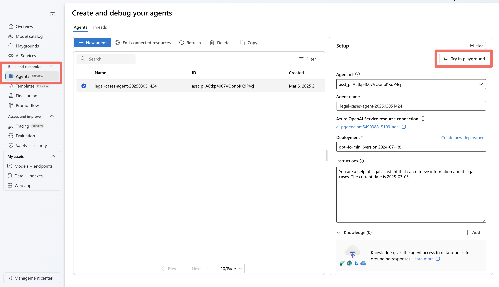
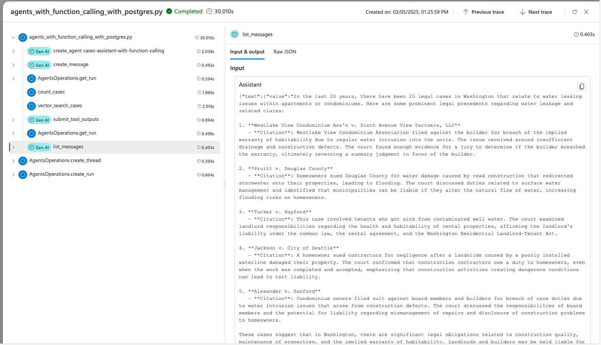

# AI Agents in Azure Database for PostgreSQL
Artificial Intelligence (AI) agents are transforming how applications interact with data by combining large language models (LLMs) with external tools and databases. Agents enable the automation of complex workflows, enhance information retrieval accuracy, and facilitate natural language interfaces to databases. This article explores how to create intelligent AI agents capable of searching and analyzing your data in Azure Database for PostgreSQL. We walk through setup, implementation, and testing using a legal research assistant as our example.

## What are AI agents?
AI agents go beyond simple chatbots by combining large language models (LLMs) with external tools and databases. Unlike standalone LLMs or standard RAG systems, AI agents can:

- **Plan**: Break down complex tasks into smaller, sequential steps.
- **Use Tools**: Use APIs, code execution, and search systems to gather information or perform actions.
- **Perceive**: Understand and process inputs from various data sources.
- **Remember**: Store and recall previous interactions for better decision-making.

By connecting AI agents to databases like Azure Database for PostgreSQL, agents can deliver more accurate, context-aware responses based on your data. AI agents extend beyond basic human conversation to perform tasks based on natural language. These tasks traditionally required coded logic; however, agents can plan the tasks needed to execute based on user-provided context.

## Implementation of AI agents

Implementing AI agents with Azure Database for PostgreSQL involves integrating advanced AI capabilities with robust database functionalities to create intelligent, context-aware systems. By leveraging tools like vector search, embeddings, and Azure AI Agent Service, developers can build agents capable of understanding natural language queries, retrieving relevant data, and providing actionable insights. This section outlines the step-by-step process to set up, configure, and deploy AI agents, enabling seamless interaction between AI models and your PostgreSQL database.

### Frameworks

Various frameworks and tools can facilitate the development and deployment of AI agents. All these frameworks support using Azure Database for PostgreSQL as a tool 

- [Azure AI Agent Service](/azure/ai-services/agents/overview)
- [LangChain/LangGraph](https://python.langchain.com/v0.1/docs/modules/agents/)
- [LlamaIndex](https://docs.llamaindex.ai/en/stable/use_cases/agents/)
- [Semantic Kernel](/semantic-kernel/overview/)
- [AutoGen](https://microsoft.github.io/autogen/)
- [OpenAI Assistants API](https://platform.openai.com/docs/assistants/overview)

## Implementation sample

We use the [Azure AI Agent Service](/azure/ai-services/agents/overview) for agent planning, tool usage, and perception while using the Azure Database for PostgreSQL as a tool for vector database and semantic search capabilities.

In the tutorial, we build an AI agent that helps legal teams research relevant cases to support their clients in Washington state. Our agent:

1. Accept natural language queries about legal situations.
1. Use vector search in Azure Database for PostgreSQL to find relevant case precedents.
1. Analyze and summarize the findings in a helpful format for legal professionals.

### Prerequisites

1. [Enable and configure](generative-ai-azure-overview.md#enable-the-azure_ai-extension) `azure_ai` & `pg_vector` extension.
1. [Create an Azure AI Foundry Project](/azure/ai-services/agents/quickstart?pivots=ai-foundry-portal).
1. [Deploy models](/azure/ai-services/agents/quickstart?pivots=ai-foundry-portal#deploy-a-model) `gpt-4o-mini` & `text-embedding-small`
1. Install [Visual Studio Code](https://code.visualstudio.com/download).
1. Install the [Python](https://marketplace.visualstudio.com/items?itemName=ms-python.python) extension.
1. Install [Python 3.11.x](https://www.python.org/downloads/).
1. Install [Azure CLI.](/cli/azure/install-azure-cli-windows?tabs=powershell)(latest version)

    > [!NOTE]
    > You need the key and endpoint from the deployed models you created for the agent.

### Getting started

All the code and sample datasets are available in [this GitHub repository](https://github.com/Azure-Samples/postgres-agents).

### Step 1: Set up vector search in Azure Database for PostgreSQL

First, we prepare our database to store and search legal case data using vector embeddings:

### Environment setup

If using macOS / bash:

```bash
python -m venv .pg-azure-ai 
source .pg-azure-ai/bin/activate 
pip install -r requirements.txt
```

Windows / PowerShell

```bash
python -m venv .pg-azure-ai 
.pg-azure-ai \Scripts\Activate.ps1 
pip install -r requirements.txt
```

Windows / cmd.exe:

```bash
python -m venv .pg-azure-ai 
.pg-azure-ai \Scripts\activate.bat 
pip install -r requirements.txt
```

### Configure environment variables

Create a `.env` file with your credentials:

```bash
AZURE_OPENAI_API_KEY="" 
AZURE_OPENAI_ENDPOINT="" 
EMBEDDING_MODEL_NAME="" 
AZURE_PG_CONNECTION=""
```
 
### Load documents and vectors

The Python file [load_data/main.py](https://github.com/Azure-Samples/postgres-agents/blob/main/load_data/main.py) serves as the central entry point for loading data into Azure Database for PostgreSQL. The code processes the [sample cases data](https://github.com/Azure-Samples/postgres-agents/blob/main/load_data/cases.csv), including information about cases in Washington.


High-level details of [main.py](https://github.com/Azure-Samples/postgres-agents/blob/main/load_data/main.py):
1. **Database setup and Table Creation**: Creates necessary extensions, sets up OpenAI API settings, and manages database tables by dropping existing ones and creating new ones for storing case data.
1. **Data Ingestion**: This process reads data from a CSV file and inserts it into a temporary table, then processes and transfers it into the main case table.
1. **Embedding Generation**: Adds a new column for embeddings in the cases table and generates embeddings for case opinions using OpenAI's API, storing them in the new column. The embedding process takes ~3-5 minutes

To start the data loading process, run the following command from the *load_data* directory:

```bash
python main.py
```

Here's the output of *main.py*:

```output
Extensions created successfully 
OpenAI connection established successfully 
The case table was created successfully 
Temp cases table created successfully 
Data loaded into temp_cases_data table successfully 
Data loaded into cases table successfully.
Adding Embeddings will take a while, around 3-5 mins.
Embeddings added successfully All Data loaded successfully!
```

### Step 2: Create a Postgres tool for the agent

We are configuring AI agent tools to retrieve data from Postgres and then using the **Azure AI Agent Service SDK** to connect your AI agent to the Postgres database.

### Define a function for your agent to call

Start by defining a function for your agent to call by describing its structure and any required parameters in a docstring. Include all your function definitions in a single file, [legal_agent_tools.py](https://github.com/Azure-Samples/postgres-agents/blob/main/src/legal_agent_tools.py), which you can then import into your main script.

```python
def vector_search_cases(vector_search_query: str, start_date: datetime ="1911-01-01", end_date: datetime ="2025-12-31", limit: int = 10) -> str:
    """
 Fetches the case information in Washington State for the specified query.

 :param query(str): The query to fetch cases specifically in Washington.
 :type query: str
 :param start_date: The start date for the search defaults to "1911-01-01"
 :type start_date: datetime, optional
 :param end_date: The end date for the search, defaults to "2025-12-31"
 :type end_date: datetime, optional
 :param limit: The maximum number of cases to fetch, defaults to 10
 :type limit: int, optional

 :return: Cases information as a JSON string.
 :rtype: str
 """
        
 db = create_engine(CONN_STR)
    
 query = """
 SELECT id, name, opinion, 
 opinions_vector <=> azure_openai.create_embeddings(
 'text-embedding-3-small', %s)::vector as similarity
 FROM cases
 WHERE decision_date BETWEEN %s AND %s
 ORDER BY similarity
 LIMIT %s;
 """
    
    # Fetch cases information from the database
 df = pd.read_sql(query, db, params=(vector_search_query,datetime.strptime(start_date, "%Y-%m-%d"), datetime.strptime(end_date, "%Y-%m-%d"),limit))

 cases_json = json.dumps(df.to_json(orient="records"))
    return cases_json
 ```

### Step 3: Create and configure the AI agent with Postgres

Now we'll set up the AI agent and integrate it with our PostgreSQL tool. The Python file [src/simple_postgres_and_ai_agent.py](https://github.com/Azure-Samples/postgres-agents/blob/main/src/simple_postgres_and_ai_agent.py) serves as the central entry point for creating and using your agent.

High level details of [simple_postgres_and_ai_agent.py](https://github.com/Azure-Samples/postgres-agents/blob/main/src/simple_postgres_and_ai_agent.py):

1. **Create an Agent**: Initializes the agent in your Azure AI Project with a specific model.
1. **Add Postgres tool**: During the agent initialization, the Postgres tool for vector search on your database is added.
1. **Create a Thread**: Sets up a communication thread. This is used to send messages to the agent to process
1. **Run the Agent and Call Postgres tool**: Processes the user's query using the agent and tools. The agent can plan with tools to use to get the correct answer. In this use case, the agent calls the Postgres tool based on the function signature and docstring to do a vector search and retrieve the relevant data to answer the question.
1. **Display the Agent’s Response**: This function outputs the agent's response to the user's query.
 

### Find the project connection string in Azure AI Foundry

In your Azure AI Foundry project, you find your Project Connection String from the Overview page of the project. We use this string to connect the project to the AI agent SDK. Add this string to the .env file.

 

### Connection Setup
Add these variables to your *.env* file in the root directory:

```shell
PROJECT_CONNECTION_STRING=" " 
MODEL_DEPLOYMENT_NAME="gpt-4o-mini" 
AZURE_TRACING_GEN_AI_CONTENT_RECORDING_ENABLED="true"
```

```python
### Create the Agent with Tool Access
We created the agent in the AI Foundry project and added the Postgres tools needed to query the Database. The code snippet below is an excerpt from the file [simple_postgres_and_ai_agent.py](https://github.com/Azure-Samples/postgres-agents/blob/main/src/simple_postgres_and_ai_agent.py).

# Create an Azure AI Client
project_client = AIProjectClient.from_connection_string(
    credential=DefaultAzureCredential(),
    conn_str=os.environ["PROJECT_CONNECTION_STRING"],
)

# Initialize agent toolset with user functions
functions = FunctionTool(user_functions)
toolset = ToolSet()
toolset.add(functions)

agent = project_client.agents.create_agent(
    model= os.environ["MODEL_DEPLOYMENT_NAME"], 
    name="legal-cases-agent",
    instructions= "You are a helpful legal assistant who can retrieve information about legal cases.", 
    toolset=toolset
)
```

### Create communication thread

This code snippet shows how to create an agent thread and message, which the agent processes in a run.

```python
# Create thread for communication
thread = project_client.agents.create_thread()

# Create message to thread
message = project_client.agents.create_message(
    thread_id=thread.id,
    role="user",
    content="Water leaking into the apartment from the floor above. What are the prominent legal precedents in Washington regarding this problem in the last 10 years?"
)
```

### Process the request

This code snippet creates a run for the agent to process the message and use the appropriate tools to provide the best result.

Using the tool, the agent can call your Postgres and the vector search on the query “Water leaking into the apartment from the floor above”* to retrieve the data it needs to best answer the question.

```python
from pprint import pprint

# Create and process agent run in thread with tools
run = project_client.agents.create_and_process_run(
thread_id=thread.id, 
agent_id=agent.id
)

# Fetch and log all messages
messages = project_client.agents.list_messages(thread_id=thread.id)
pprint(messages['data'][0]['content'][0]['text']['value'])
```

### Run the agent

To run the agent, run the following command from the src directory:

```bash
python simple_postgres_and_ai_agent.py
```

The agent produces a similar result using the Azure Database for PostgreSQL tool to access case data saved in the Postgres Database.

Snippet of output from agent:

```
1.     Pham v. Corbett

Citation: Pham v. Corbett, No. 4237124
Summary: This case involved tenants who counterclaimed against their landlord for relocation assistance and breached the implied warranty of habitability due to severe maintenance issues, including water and sewage leaks. The trial court held that the landlord had breached the implied warranty and awarded damages to the tenants.

2.     Hoover v. Warner

Citation: Hoover v. Warner, No. 6779281
Summary: The Warners appealed a ruling finding them liable for negligence and nuisance after their road grading project caused water drainage issues affecting Hoover's property. The trial court found substantial evidence supporting the claim that the Warners' actions impeded the natural water flow and damaged Hoover's property.
```

### Step 4: Testing and debugging with Azure AI Foundry playground
After running your agent with Azure AI Agent SDK, the agent is stored in your project, and you can experiment with the agent in the Agent playground.

### Using the agent playground

1. Navigate to the Agents section in Azure AI Foundry
1. Find your agent in the list and Select to open
1. Use the playground interface to test various legal queries
   

1. Test the query *“Water leaking into the apartment from the floor above, What are the prominent legal precedents in Washington?”* The agent picks the right tool to use and ask for the expected output for that query. Use [sample_vector_search_cases_output.json](https://github.com/Azure-Samples/postgres-agents/blob/main/src/sample_outputs_for_playground/sample_vector_search_cases_output.json) as the sample output.
   

### Step 5: Debugging with Azure AI Foundry tracing

When developing the agent using the Azure AI Foundry SDK, you can [debug the agent with Tracing.](/azure/ai-services/agents/concepts/tracing), allowing you to debug the calls to tools like Postgres and see how the agent orchestrates each task.

### Debugging with tracing

1. Select Tracing in the Azure AI Foundry menu
1. Create a new Application Insights resource or connect an existing one
   

1. View detailed traces of your agent's operations
   

Learn more about how to set up tracing with the AI agent and Postgres in the [advanced_postgres_and_ai_agent_with_tracing.py file on GitHub](https://github.com/Azure-Samples/postgres-agents/blob/main/src/advanced_postgres_and_ai_agent_with_tracing.py).


## Related content

- [GenAI Frameworks and Azure Database for PostgreSQL](generative-ai-frameworks.md)
- [Using LangChain with Azure Database for PostgreSQL](generative-ai-develop-with-langchain.md)
- [Learn more about Azure OpenAI Service integration](generative-ai-azure-openai.md)
- [Azure AI extension in Azure Database for PostgreSQL flexible server](generative-ai-azure-overview.md).
- [Semantic Search with Azure Database for PostgreSQL flexible server and Azure OpenAI](generative-ai-semantic-search.md).
- [Enable and use pgvector in Azure Database for PostgreSQL flexible server](how-to-use-pgvector.md).
