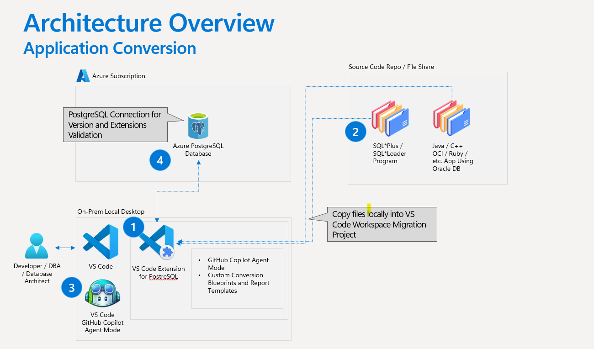
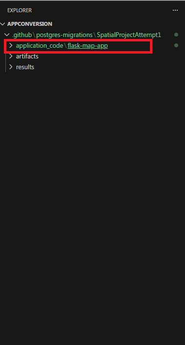
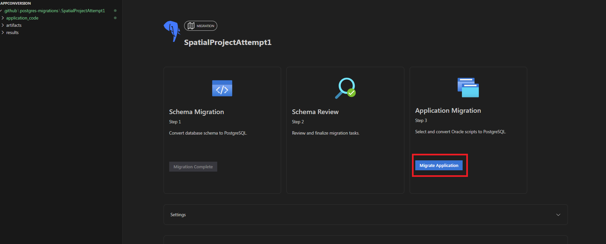
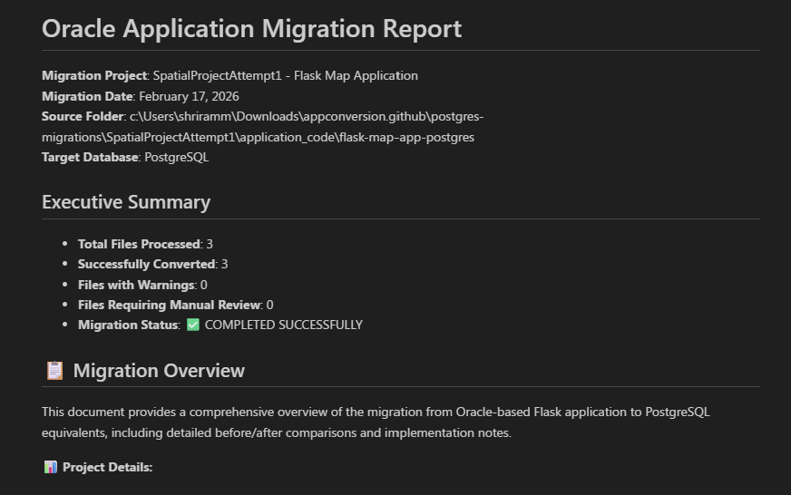

# What is Oracle to Azure Database for PostgreSQL application conversion (Preview)?

The Oracle to Azure Database for PostgreSQL application conversion feature helps you migrate existing Oracle-based applications to work with Azure Database for PostgreSQL by automatically converting Oracle-specific database interaction code into PostgreSQL-compatible code.

This feature is designed to accelerate application modernization and reduce manual rewrite effort during Oracle-to-PostgreSQL migrations.

The application conversion capability is available through the Visual Studio Code PostgreSQL extension and integrates with GitHub Copilot Agent Mode to assist with code transformation and review workflows.

> **NOTE**: This feature is currently in preview. Conversion coverage, supported patterns, and automation quality will continue to improve.

## When should you use application conversion?

Use this feature if
 - You have an existing application that connects to Oracle databases
 - You are migrating your Oracle databases to Azure Database for PostgreSQL
 - You want to accelerate application migration and reduce manual code rewrite effort
 - You have completed (or plan to complete) schema conversion

## How application conversion fits into your migration journey

Application conversion is typically one step in a larger migration workflow:
1.	Convert Oracle schema to Azure Database for PostgreSQL
2.	Deploy and validate your Azure Database for PostgreSQL database
3.	Convert application code
4.	Perform functional validation and testing
5.	Optimize performance and database interactions

Completing schema conversion before application conversion is strongly recommended because schema metadata improves application conversion accuracy.

## Architecture

The application conversion process involves multiple components working together to transform your Oracle-based applications for PostgreSQL:



The architecture demonstrates how the Visual Studio Code PostgreSQL extension, GitHub Copilot Agent Mode, and Azure Database for PostgreSQL collaborate to provide intelligent, context-aware code conversion with comprehensive reporting and validation capabilities.

## Why use the application conversion feature?

Application conversion helps reduce migration complexity by automating common Oracle-to-PostgreSQL application changes.

Key benefits include:
 - **Automated code transformation** - Converts Oracle-specific SQL syntax, connection logic, and database interaction patterns.
 - **Schema-aware conversion** - Uses schema conversion metadata to improve accuracy.
 - **Database context awareness** - Aligns application code with deployed PostgreSQL schema objects.
 - **Integrated developer workflow** - Runs directly inside Visual Studio Code.
 - **Review and reporting support** - Generates conversion reports, TODO lists, and file comparison views.

> **NOTE**: Application conversion accelerates migration but does not replace application validation. AI-assisted code transformation can produce incorrect or incomplete results. You must validate converted code through functional testing, integration testing, and performance testing before production deployment.

## Prerequisites

Before you begin, ensure you have:

### Required Components
- **Visual Studio Code** (v1.95.2+)
- PostgreSQL extension for Visual Studio Code
- **GitHub Copilot** subscription (Pro+, Business, or Enterprise) 
- **AI Model Access**: Claude Sonnet 4.6 or Claude Opus 4.6 (or similar code-centric model such as GPT-5.2-Codex; as critical for high-quality conversion results)
- **Target Database**: Azure Database for PostgreSQL Flexible Server (v15+) or Azure HorizonDB (v17+)

### Recommended Setup
- **Completed schema conversion** (strongly recommended for best results)  
- **Network access** to your PostgreSQL database
- •	Access to the full application codebase

## Complete Setup

### Install the Extension
1. **Open Extensions Marketplace**: In Visual Studio Code, select the Extensions icon in the Activity Bar on the left side, or use the keyboard shortcut `Ctrl+Shift+X` (Windows/Linux) or `Cmd+Shift+X` (macOS).

2. **Search for PostgreSQL**: In the Extensions Marketplace search box, type "PostgreSQL" to find the extension.

3. **Install the Extension**: Locate the PostgreSQL extension in the search results and select Install.

4. **Access Application Conversion**: When the extension is installed, you can access the Application Conversion feature through the Migration Wizard interface after completing a schema conversion project.

### Schema Conversion
Complete the schema conversion process for the schemas you want to migrate from Oracle to PostgreSQL

### Model Setup
1. Open the GitHub Copilot chat interface.
2. Select **Claude Sonnet 4.6 or Claude Opus 4.6** for the model.


> Using Claude Sonnet 4.6 or Claude Opus 4.6 is required for optimal application conversion results. Lower models may produce less accurate conversions.

### Codebase Preparation
1. Open the workspace containing your schema conversion project.
2. Navigate to the migration project folder structure:
   ```
   .github/postgres-migration/project_name/
   ```
3. Verify the project structure includes the necessary folders and files from schema conversion.

4. Copy your codebase into the migration project

    - Locate the `application_code` folder in your project:
   ```
   .github/postgres-migration/project_name/application_code/
   ```
    - Copy the codebase folder you want to migrate into the `application_code` folder inside your project folder.
    - Organize files logically to facilitate systematic conversion.

   

    > Keep your original application code in a separate location as a backup. Only copy the files you want to convert into the migration project structure.

## Quick Start Checklist

Before starting the application conversion process, verify you have completed:

- **Schema conversion completed** for your Oracle database
- **VS Code + PostgreSQL extension** installed and configured  
- **GitHub Copilot subscription** active (Pro+, Business, or Enterprise)
- **Claude Sonnet 4.6 or Claude Opus 4.6** model selected in GitHub Copilot
- **Application code backed up** in a separate location
- **PostgreSQL database** accessible and schema deployed
- **Application codebase** ready for copying into migration project


## Conversion Workflow

### Start application code migration
1. In the PostgreSQL extension Migration panel, select **Migrate Application** to start the application conversion wizard.
2. On the form that loads, select the folder you copied into the root of your workspace.
3. Choose the database that has the context for your application:
   - The PostgreSQL database where you deployed your converted DDL, or
   - The PostgreSQL database where your application schema already exists
4. Select **Convert Application**.


This action initiates the following processes:

- Invokes a custom composite prompt and Agent Mode Tool
- Generates a TODO list of tasks that Agent Mode proceeds to work on
- Connects to and reads your database for enhanced context
- Systematically converts application code files

### Monitor conversion progress

1. Watch the GitHub Copilot Agent Mode interface as it processes files.
2. The agent will work through the generated TODO list systematically.
3. Review any prompts or questions from the agent that may require input.
4. Allow the conversion process to complete fully before reviewing results.


### Review and Validate
The tool generates the following files for review:
 - TODO lists for manual follow-up work
 - Conversion reports
 - File comparison views


## Core Concepts

### Coding Notes

Coding Notes are metadata artifacts generated during schema conversion. They capture transformation decisions such as:
 - Data type mappings
 - Sequence and identity conversions
 - Date and time handling adjustments
 - Object dependency relationships
 - Procedure and function signatures

During application conversion, these notes improve translation accuracy and consistency.

### Database context integration

The conversion workflow can connect to your Azure Database for PostgreSQL database to:
 - Validate object references
 - Align application code with deployed schema
 - Validate function and procedure signatures

## Supported Language and Frameworks

The application conversion tool supports many common Oracle-connected application stacks including:
 - Java (JDBC, Spring, Hibernate)
 - Python (cx_Oracle, SQLAlchemy)
 - .NET (Oracle.DataAccess, ODP.NET)
 - Node.js (oracledb package)
 - C++ (OCCI, Pro*C)
 - Ruby (ruby-oci8, ActiveRecord Oracle adapter)
 - Other languages using Oracle database connectivity

## Conversion Coverage
Application conversion focuses on:
 - Oracle SQL syntax embedded in application code
 - Database connection configuration
 - Data type usage in application logic
 - Stored procedure and function calls
 - Migration from Oracle-specific database libraries to PostgreSQL-compatible equivalents

Conversion completeness may vary depending on application architecture, database usage patterns, and Oracle-specific feature usage.

## Feedback and support

For bugs, feature requests, and issues related to the Application Conversion feature or the PostgreSQL extension, use the built-in feedback tool in Visual Studio Code.

### Help menu

Go to **Help > Report Issue**

### Command Palette

1. Open the Command Palette with `Ctrl+Shift+P` (Windows/Linux) or `Cmd+Shift+P` (macOS).
2. Run the command: **PGSQL: Report Issue**.

When you create your issue or provide feedback, include `Application Conversion:` as a prefix in your title. This prefix helps the development team quickly identify and prioritize Application Conversion-related feedback.

## Related content

- [Oracle to PostgreSQL Application Conversion Tutorial](app-conversions-tutorial.md)
- [Oracle to PostgreSQL Application Conversion Best Practices](app-conversions-best-practices.md)
- [Oracle to PostgreSQL Application Conversion Limitations](app-conversions-limitations.md)
- [Oracle to PostgreSQL Schema Conversion Overview](../oracle-schema-conversions/schema-conversions-overview.md)
