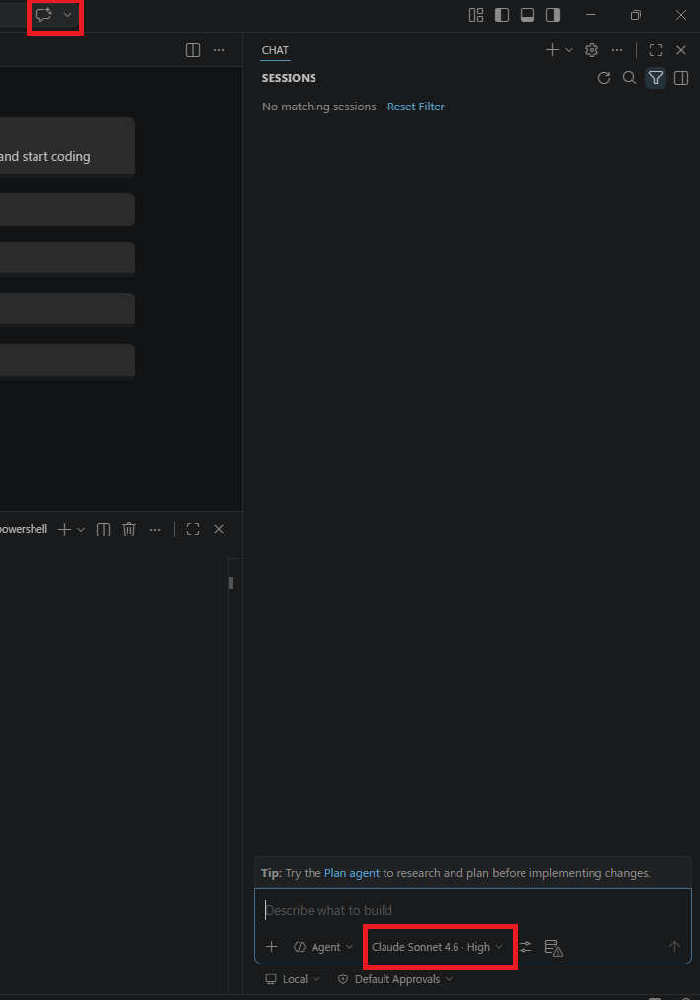

# Tutorial: Oracle to Azure Database for PostgreSQL application conversion (Preview)

This tutorial guides you through converting Oracle client application code to Azure Database for PostgreSQL using the Visual Studio Code PostgreSQL extension with GitHub Copilot Agent Mode to automate and validate code transformation.

It covers setting up your environment, importing your application codebase, running the conversion process, and reviewing the generated PostgreSQL-compatible code. Before you begin, ensure you have completed a schema conversion project for optimal results.

Here's what you can expect during the conversion:

- **Environment Setup**: Configure GitHub Copilot Agent Mode with the appropriate AI model
- **Codebase Import**: Organize your application code in the migration project structure
- **AI Processing**: GitHub Copilot processes and converts application code using database context
- **TODO Task Execution**: Automated task list generation and systematic conversion
- **Report Generation**: Comprehensive conversion report with results and recommendations
- **File Comparison**: Built-in diff tools for reviewing original vs. converted code

## Prerequisites

This section describes the prerequisites for using the Oracle to Azure Database for PostgreSQL application conversion feature in Visual Studio Code before starting a conversion.

### System requirements

| Requirement | Specification |
|-------------|---------------|
| Visual Studio Code version | 1.95.2 or higher |
| GitHub Copilot subscription | Pro+, Business, Enterprise |

### Operating system support

| Platform | Architecture |
|----------|-------------|
| Windows | x64 and ARM64 |
| Linux | x64 and ARM64 |
| macOS | x64 (Intel) and ARM64 (Apple Silicon) |

### AI model requirements

You need one of the following AI models configured in GitHub Copilot Agent Mode:

| Model | Version |
|-------|---------|
| Claude | Sonnet 4.6 or Opus 4.6 or higher |

> Before starting application conversion, set your GitHub Copilot Agent Mode Model to Claude Sonnet 4.6 or Claude Opus 4.6 or higher for optimal code transformation results.

### PostgreSQL version support

| Target Database | Version |
|----------------|---------|
| Azure Database for PostgreSQL Flexible Server | PostgreSQL version 15 or higher |
| Azure HorizonDB | PostgreSQL version 17 or higher |

### Schema conversion recommendation

While it's not required to perform a database schema conversion beforehand, we strongly recommend completing a schema migration first. If you already converted your Oracle schema to PostgreSQL, the application conversion process provides more accurate context and higher-quality code transformation results through:

- **Coding Notes**: Metadata artifacts generated during schema conversion (see [What are Coding Notes?](#what-are-coding-notes) below)
- **Database context**: Direct access to converted schema objects
- **Data type mappings**: Accurate understanding of type transformations


### Other prerequisites

- Database connectivity to your Azure Database for PostgreSQL instance
- Access to Visual Studio Code extension marketplace and GitHub Copilot services

## What are "Coding Notes"?

Coding Notes are metadata artifacts automatically generated during the schema conversion phase. They capture key transformation details and insights from your Oracle-to-PostgreSQL schema conversion that the process later uses to enhance application code conversion.

Coding Notes might include information such as:

- Data type mappings and structural changes
- Conversion details for sequences, identities, and composite types
- Adjustments to date/time or interval implementations
- References to tables with referential integrity constraints
- Summaries of complex Oracle packages, including procedure and function signatures
- Additional AI-generated hints to improve code translation accuracy

During application conversion, the AI model uses these notes as contextual signals to produce more precise and semantically aligned PostgreSQL-compatible code.

## Application conversion process

This section walks through the complete application conversion workflow: set up your environment, import your codebase, run the conversion, review the generated report, and compare file changes.

### Step 1: Set up your environment

 - Open Visual Studio Code with the PostgreSQL extension installed.
 - Open the GitHub Copilot chat interface.
 - Select **Claude Sonnet 4.6 or Claude Opus 4.6** for the model.



> Using Claude Sonnet 4.6 or Claude Opus 4.6 is required for optimal application conversion results. Lower models may produce less accurate conversions.

### Step 2: Open your migration project

 - Open the workspace containing your schema conversion project.
 - Navigate to the migration project folder structure:
   ```
   .github/postgres-migration/project_name/
   ```
 - Verify the project structure includes the necessary folders and files from schema conversion.

### Step 3: Copy your codebase into the migration project

 - Locate the `application_code` folder in your project:
   ```
   .github/postgres-migration/project_name/application_code/
   ```
 - Copy the codebase folder you want to migrate into the `application_code` folder inside your project folder.
 - Organize files logically to facilitate systematic conversion.


> Keep your original application code in a separate location as a backup. Only copy the files you want to convert into the migration project structure.

### Step 4: Start client code migration

 - In the PostgreSQL extension Migration panel, select **Migrate Application** to start the application conversion wizard.
 - On the form that loads, select the folder you copied into the root of your workspace.
 - Choose the database that has the context for your application:
   - The PostgreSQL database where you deployed your converted DDL, or
   - The PostgreSQL database where your application schema already exists
 - Select **Convert Application**.


This action initiates the following processes:

- Invokes a custom composite prompt and Agent Mode Tool
- Generates a TODO list of tasks that Agent Mode proceeds to work on
- Connects to and reads your database for enhanced context
- Systematically converts application code files

### Step 5: Monitor conversion progress

 - Watch the GitHub Copilot Agent Mode interface as it processes files.
 -  The agent will work through the generated TODO list systematically.
 - Review any prompts or questions from the agent that may require input.
 - Allow the conversion process to complete fully before reviewing results.

### Step 6: Enhanced Java conversion with GitHub Copilot App Modernization Extension (Optional)

**If working with Java code**: You can enhance your conversion process by installing the [GitHub Copilot App Modernization Extension](https://marketplace.visualstudio.com/items?itemName=vscjava.migrate-java-to-azure) before starting your conversion.

#### Automatic test compilation

The two VS Code extensions communicate with each other to provide seamless integration. When converting Java code, the App Modernization Extension automatically performs a test compilation of your converted code to identify any syntax errors or compilation issues early in the process.

#### Automatic unit test generation

Based on your converted codebase, the App Modernization Extension automatically generates unit tests to help validate that your converted application behaves correctly. This integration leverages the App Modernization Extension's capabilities to:

- Analyze your converted Java classes and methods
- Generate appropriate test cases for critical code paths
- Create test fixtures that work with your PostgreSQL database connections

> Installing the GitHub Copilot App Modernization Extension is highly recommended for Java migration projects, as it significantly accelerates validation and improves conversion quality through automated compilation checks and test generation.

### Step 7: Review code conversion report

 - When the application conversion finishes in Agent Mode, it automatically generates and opens a comprehensive report.
 - The report provides detailed results and recommended next steps for your conversion.


> **For comprehensive report guidance**: See the [Reports document](app-conversions-reports.md) for detailed information on interpreting your conversion results, understanding file statuses, and planning your validation strategy.

### Step 8: Compare code changes using file diff feature

 - Right-click a converted file (for example, a `.java` file) and select **Compare App Migration File Pairs**.
 - This opens a side-by-side view of original and converted files.
 - Use this to validate critical transformations before testing.

> **Effective file comparison strategy**: See the [Reports document](app-conversions-reports.md) for guidance on prioritizing which files to review first and how to focus your validation efforts.

### Step 9: Validate converted application code

**Essential validation steps:**
 - Set up a **nonproduction test environment** with your converted PostgreSQL schema
 - **Test database connectivity** with the new PostgreSQL connection strings
 - **Execute critical business workflows** to verify application behavior
 - **Validate SQL query results** against expected outcomes from Oracle
 - **Address flagged areas** identified in the conversion report

> **Customer validation responsibility**: AI systems can occasionally make mistakes. To prevent functional regressions, security issues, or data access problems, independently validate all converted application code before deploying to production.

> **Systematic validation approach**: Use the validation frameworks in the [Best Practices document](app-conversions-best-practices.md) to prioritize testing based on your Oracle integration complexity and conversion report results.

## Post-conversion steps

After completing the application conversion:

 - **Run unit tests**: Execute your application's test suite against the converted code.
 - **Integration testing**: Test the application with your PostgreSQL database.
 - **Performance testing**: Validate that query performance meets requirements.
 - **Code review**: Have team members review the converted code for accuracy.
 - **Documentation update**: Update any documentation that references Oracle-specific features.

> **Comprehensive validation strategies**: See [Best Practices document](app-conversions-best-practices.md) for detailed validation frameworks, testing priorities, and team coordination approaches based on your conversion complexity.

For more information about the Visual Studio Code extension, visit [PostgreSQL extension for Visual Studio Code](../../developer/vs-code-extension/vs-code-overview.md).

## Related content

- [Oracle to PostgreSQL Application Conversion Overview](app-conversions-overview.md)
- [Oracle to PostgreSQL Application Conversion Reports](app-conversions-reports.md)
- [Oracle to PostgreSQL Application Conversion Best Practices](app-conversions-best-practices.md)
- [Oracle to PostgreSQL Application Conversion Limitations](app-conversions-limitations.md)
